# Mổ xẻ cơ sở dữ liệu CinemaSystem

Ngày rà soát: 07/06/2026

## 1. Phạm vi và nguồn đối chiếu

Tài liệu này phân tích schema trong `OnepieceOfG2/DB_CinemaBookingDB.txt`, đồng thời đối chiếu với:

- `Giai_thich_Conceptual_ERD_SRS_Rap_Chieu_Phim.docx`
- `Backend_System_Design_CinemaBooking_Group2_CleanArchitecture.docx`
- `SRS_Group2.docx`
- `Bussiness Rule.docx`
- EF Core models và `CinemaDbContext` trong `CinemaSystem.Infrastructure/Persistence`

Schema có 30 bảng, chia thành 8 nhóm nghiệp vụ:

| Nhóm | Bảng |
|---|---|
| Danh mục gốc | `ROLE`, `CINEMA`, `SEAT_TYPE`, `MOVIE`, `PAYMENT_PROVIDER`, `VOUCHER`, `FB_ITEM` |
| Tài khoản và xác thực | `USER`, `EMAIL_VERIFICATION_TOKEN`, `REFRESH_TOKEN`, `CUSTOMER_PROFILE`, `STAFF_PROFILE` |
| Cấu trúc rạp | `ROOM`, `SEAT` |
| Lịch chiếu và tồn kho ghế | `SHOWTIME`, `SHOWTIME_SEAT` |
| Đặt vé và check-in | `BOOKING`, `BOOKING_SEAT`, `TICKET`, `CHECKIN_LOG` |
| Thanh toán và hoàn tiền | `PAYMENT`, `SHOWTIME_CANCELLATION`, `REFUND` |
| Voucher và F&B | `VOUCHER_USAGE`, `BOOKING_FB_ITEM`, `CINEMA_FB_INVENTORY` |
| Loyalty và vận hành | `REWARD_POINT_TRANSACTION`, `REVIEW`, `NOTIFICATION`, `AUDIT_LOG` |

## 2. Cách đọc thiết kế

### 2.1. Cardinality

- `1:N`: một bản ghi cha có thể được nhiều bản ghi con tham chiếu.
- `1:0..N`: bản ghi cha có thể chưa có hoặc có nhiều bản ghi con.
- `1:0..1`: bản ghi cha có thể chưa có hoặc có tối đa một bản ghi con. Trong DB, dạng này thường được tạo bằng FK có `UNIQUE`.
- `N:1`: nhiều bản ghi con cùng tham chiếu một bản ghi cha.
- `N:N`: phải tách bằng bảng trung gian; bảng trung gian thường có thêm thuộc tính nghiệp vụ.

### 2.2. Quy ước constraint và index

- `PK`: định danh duy nhất của một dòng.
- `FK_*`: khóa ngoại, giữ tính toàn vẹn tham chiếu.
- `UQ_*`: unique constraint, bảo vệ tính duy nhất nghiệp vụ.
- `CK_*`: check constraint, chặn giá trị không hợp lệ.
- `IX_*`: index thường, tăng tốc truy vấn.
- `UX_*`: unique index, đôi khi có điều kiện `WHERE` để chỉ duy nhất với một tập dữ liệu.

### 2.3. Các mẫu thiết kế xuyên suốt

- ID đều là `NVARCHAR(50)`: hệ thống chủ động sinh ID dạng chuỗi như GUID hoặc mã có prefix.
- Tiền dùng `DECIMAL(18,2)`: tránh sai số của `FLOAT`.
- Thời gian dùng `DATETIME2`, mặc định UTC bằng `SYSUTCDATETIME()`.
- Giá và thông tin tại thời điểm giao dịch được chụp lại ở bảng phát sinh, ví dụ `seatPrice`, `unitPrice`, `discountAmount`. Đây là snapshot lịch sử, không phụ thuộc giá danh mục thay đổi về sau.
- Các bảng log/giao dịch được giữ lại thay vì ghi đè để hỗ trợ audit, retry và đối soát.
- Schema không khai báo `ON DELETE CASCADE`; SQL Server sẽ dùng hành vi chặn xóa khi còn dữ liệu tham chiếu. Đây là lựa chọn phù hợp với dữ liệu tài chính và lịch sử.

## 3. Bản đồ quan hệ tổng quát

```mermaid
erDiagram
    ROLE ||--o{ USER : "FK_USER_ROLE"
    USER ||--o| CUSTOMER_PROFILE : "FK_CUSTOMER_PROFILE_USER"
    USER ||--o| STAFF_PROFILE : "FK_STAFF_PROFILE_USER"
    USER ||--o{ EMAIL_VERIFICATION_TOKEN : "FK_EMAIL_VERIFICATION_USER"
    USER ||--o{ REFRESH_TOKEN : "FK_REFRESH_TOKEN_USER"

    CINEMA ||--o{ STAFF_PROFILE : "FK_STAFF_PROFILE_CINEMA"
    CINEMA ||--o{ ROOM : "FK_ROOM_CINEMA"
    ROOM ||--o{ SEAT : "FK_SEAT_ROOM"
    SEAT_TYPE ||--o{ SEAT : "FK_SEAT_SEAT_TYPE"

    MOVIE ||--o{ SHOWTIME : "FK_SHOWTIME_MOVIE"
    ROOM ||--o{ SHOWTIME : "FK_SHOWTIME_ROOM"
    SHOWTIME ||--o{ SHOWTIME_SEAT : "FK_SHOWTIME_SEAT_SHOWTIME"
    SEAT ||--o{ SHOWTIME_SEAT : "FK_SHOWTIME_SEAT_SEAT"
    USER ||--o{ SHOWTIME_SEAT : "FK_SHOWTIME_SEAT_LOCKED_BY_USER"

    CUSTOMER_PROFILE ||--o{ BOOKING : "FK_BOOKING_CUSTOMER_PROFILE"
    STAFF_PROFILE ||--o{ BOOKING : "FK_BOOKING_CREATED_BY_STAFF"
    SHOWTIME ||--o{ BOOKING : "FK_BOOKING_SHOWTIME"
    BOOKING ||--o{ BOOKING_SEAT : "FK_BOOKING_SEAT_BOOKING"
    SHOWTIME_SEAT ||--o| BOOKING_SEAT : "FK_BOOKING_SEAT_SHOWTIME_SEAT"
    BOOKING_SEAT ||--o| TICKET : "FK_TICKET_BOOKING_SEAT"
    TICKET ||--o{ CHECKIN_LOG : "FK_CHECKIN_LOG_TICKET"
    STAFF_PROFILE ||--o{ CHECKIN_LOG : "FK_CHECKIN_LOG_STAFF_PROFILE"

    PAYMENT_PROVIDER ||--o{ PAYMENT : "FK_PAYMENT_PAYMENT_PROVIDER"
    BOOKING ||--o{ PAYMENT : "FK_PAYMENT_BOOKING"
    SHOWTIME ||--o| SHOWTIME_CANCELLATION : "FK_SHOWTIME_CANCELLATION_SHOWTIME"
    USER ||--o{ SHOWTIME_CANCELLATION : "FK_SHOWTIME_CANCELLATION_USER"
    PAYMENT ||--o{ REFUND : "FK_REFUND_PAYMENT"
    BOOKING ||--o{ REFUND : "FK_REFUND_BOOKING"
    SHOWTIME_CANCELLATION ||--o{ REFUND : "FK_REFUND_SHOWTIME_CANCELLATION"

    VOUCHER ||--o{ VOUCHER_USAGE : "FK_VOUCHER_USAGE_VOUCHER"
    CUSTOMER_PROFILE ||--o{ VOUCHER_USAGE : "FK_VOUCHER_USAGE_CUSTOMER_PROFILE"
    BOOKING ||--o| VOUCHER_USAGE : "FK_VOUCHER_USAGE_BOOKING"

    BOOKING ||--o{ BOOKING_FB_ITEM : "FK_BOOKING_FB_ITEM_BOOKING"
    FB_ITEM ||--o{ BOOKING_FB_ITEM : "FK_BOOKING_FB_ITEM_FB_ITEM"
    CINEMA ||--o{ CINEMA_FB_INVENTORY : "FK_CINEMA_FB_INVENTORY_CINEMA"
    FB_ITEM ||--o{ CINEMA_FB_INVENTORY : "FK_CINEMA_FB_INVENTORY_FB_ITEM"

    CUSTOMER_PROFILE ||--o{ REWARD_POINT_TRANSACTION : "FK_REWARD_POINT_TRANSACTION_CUSTOMER_PROFILE"
    BOOKING ||--o{ REWARD_POINT_TRANSACTION : "FK_REWARD_POINT_TRANSACTION_BOOKING"
    CUSTOMER_PROFILE ||--o{ REVIEW : "FK_REVIEW_CUSTOMER_PROFILE"
    MOVIE ||--o{ REVIEW : "FK_REVIEW_MOVIE"
    BOOKING ||--o| REVIEW : "FK_REVIEW_BOOKING"
    USER ||--o{ NOTIFICATION : "FK_NOTIFICATION_USER"
    BOOKING ||--o{ NOTIFICATION : "FK_NOTIFICATION_BOOKING"
    USER ||--o{ AUDIT_LOG : "FK_AUDIT_LOG_USER"
```

`BOOKING` là trung tâm giao dịch. `SHOWTIME_SEAT` là trung tâm cạnh tranh ghế. `USER` là trung tâm định danh và phân quyền.

---

## 4. Phân tích từng bảng

## 4.1. ROLE

### Mục đích

Lưu vai trò phân quyền như `Customer`, `Staff`, `Manager`, `Admin`. Tách role khỏi `USER` giúp tên role và mô tả được quản lý tập trung, tránh mỗi user lưu một chuỗi tùy ý.

### Thuộc tính

| Cột | Kiểu/ràng buộc | Ý nghĩa và lý do tồn tại |
|---|---|---|
| `roleId` | `NVARCHAR(50)`, PK | Định danh ổn định để FK từ `USER` tham chiếu. |
| `roleName` | `NVARCHAR(100)`, NOT NULL, UNIQUE | Tên vai trò dùng cho authorization. Unique chặn hai role cùng tên. |
| `description` | `NVARCHAR(500)`, NULL | Mô tả phạm vi quyền cho quản trị và tài liệu hóa. |

### Quan hệ

- `ROLE 1:N USER`, tên FK `FK_USER_ROLE`.
- Một role có thể chưa có hoặc có nhiều user; mỗi user bắt buộc có đúng một role.

### Constraint đáng chú ý

- `UQ_ROLE_ROLE_NAME`: bảo đảm tên vai trò duy nhất.

### Vì sao không lưu role trực tiếp trong USER?

Nếu lưu chuỗi tự do, dữ liệu dễ xuất hiện `Admin`, `ADMIN`, `administrator`. Bảng `ROLE` tạo một vocabulary chuẩn và là điểm mở rộng cho mô tả hoặc permission chi tiết sau này.

## 4.2. CINEMA

### Mục đích

Đại diện một cụm rạp/chi nhánh vật lý. Đây là đơn vị gốc để quản lý phòng, nhân viên và tồn kho F&B.

### Thuộc tính

| Cột | Kiểu/ràng buộc | Ý nghĩa và lý do tồn tại |
|---|---|---|
| `cinemaId` | `NVARCHAR(50)`, PK | Định danh cụm rạp. |
| `cinemaName` | `NVARCHAR(255)`, NOT NULL | Tên hiển thị cho khách và quản trị. |
| `address` | `NVARCHAR(500)`, NOT NULL | Địa chỉ cụ thể để khách đến rạp. |
| `city` | `NVARCHAR(100)`, NOT NULL | Hỗ trợ lọc rạp theo thành phố. |
| `phoneNumber` | `NVARCHAR(30)`, NULL | Kênh liên hệ của chi nhánh. |
| `cinemaStatus` | `NVARCHAR(30)`, mặc định `ACTIVE` | Trạng thái vận hành: `ACTIVE`, `INACTIVE`, `MAINTENANCE`. |

### Quan hệ

- `CINEMA 1:N ROOM`, qua `FK_ROOM_CINEMA`.
- `CINEMA 1:N STAFF_PROFILE`, qua `FK_STAFF_PROFILE_CINEMA`.
- `CINEMA 1:N CINEMA_FB_INVENTORY`, qua `FK_CINEMA_FB_INVENTORY_CINEMA`.

### Constraint

- `CK_CINEMA_STATUS`: chỉ cho phép `ACTIVE`, `INACTIVE`, `MAINTENANCE`.

### Vì sao cần status thay vì xóa?

Rạp đã có phòng, suất chiếu, booking và dữ liệu doanh thu không nên bị xóa cứng. Status cho phép ngừng bán hoặc bảo trì mà vẫn giữ lịch sử.

## 4.3. SEAT_TYPE

### Mục đích

Danh mục loại ghế như Standard, VIP, Sweetbox. Loại ghế quyết định phụ thu và được dùng lại cho nhiều ghế vật lý.

### Thuộc tính

| Cột | Kiểu/ràng buộc | Ý nghĩa và lý do tồn tại |
|---|---|---|
| `seatTypeId` | `NVARCHAR(50)`, PK | Định danh loại ghế. |
| `typeName` | `NVARCHAR(100)`, NOT NULL, UNIQUE | Tên loại ghế; unique tránh trùng danh mục. |
| `extraFee` | `DECIMAL(18,2)`, mặc định `0`, `>= 0` | Phụ thu cộng vào giá cơ bản của suất chiếu. |

### Quan hệ

- `SEAT_TYPE 1:N SEAT`, qua `FK_SEAT_SEAT_TYPE`.

### Vì sao không lưu extraFee trên SEAT?

Nhiều ghế cùng loại có cùng chính sách phụ thu. Tách bảng tránh lặp dữ liệu và giúp cập nhật chính sách theo loại.

## 4.4. MOVIE

### Mục đích

Lưu metadata của phim để hiển thị catalog và làm đầu vào tạo suất chiếu.

### Thuộc tính

| Cột | Kiểu/ràng buộc | Ý nghĩa và lý do tồn tại |
|---|---|---|
| `movieId` | `NVARCHAR(50)`, PK | Định danh phim. |
| `title` | `NVARCHAR(255)`, NOT NULL | Tên phim. |
| `durationMinutes` | `INT`, `> 0` | Thời lượng để hiển thị và tính giờ kết thúc suất chiếu. |
| `genre` | `NVARCHAR(255)`, NULL | Thể loại dạng mô tả; schema hiện chưa chuẩn hóa thành bảng riêng. |
| `language` | `NVARCHAR(100)`, NULL | Ngôn ngữ phim. |
| `releaseDate` | `DATE`, NULL | Ngày phát hành, hỗ trợ phân loại sắp chiếu/đang chiếu. |
| `ageRating` | `NVARCHAR(30)`, NULL | Nhãn độ tuổi để kiểm soát nội dung. |
| `description` | `NVARCHAR(MAX)`, NULL | Nội dung giới thiệu dài. |
| `posterUrl` | `NVARCHAR(1000)`, NULL | URL ảnh poster. |
| `trailerUrl` | `NVARCHAR(1000)`, NULL | URL trailer. |
| `movieStatus` | `NVARCHAR(30)`, mặc định `COMING_SOON` | `COMING_SOON`, `NOW_SHOWING`, `ENDED`, `INACTIVE`. |

### Quan hệ

- `MOVIE 1:N SHOWTIME`, qua `FK_SHOWTIME_MOVIE`.
- `MOVIE 1:N REVIEW`, qua `FK_REVIEW_MOVIE`.

### Constraint

- `CK_MOVIE_DURATION`: thời lượng phải dương.
- `CK_MOVIE_STATUS`: giới hạn vòng đời phim.

### Điểm cần lưu ý

`genre`, `language`, `ageRating` đang là chuỗi. Thiết kế đơn giản, phù hợp MVP, nhưng khó lọc chuẩn nếu một phim có nhiều thể loại hoặc dữ liệu nhập không đồng nhất.

## 4.5. PAYMENT_PROVIDER

### Mục đích

Danh mục cổng thanh toán như VNPAY, MoMo. Tách provider khỏi giao dịch giúp hệ thống hỗ trợ nhiều cổng và bật/tắt từng cổng.

### Thuộc tính

| Cột | Kiểu/ràng buộc | Ý nghĩa và lý do tồn tại |
|---|---|---|
| `paymentProviderId` | `NVARCHAR(50)`, PK | Định danh provider. |
| `providerName` | `NVARCHAR(100)`, NOT NULL, UNIQUE | Tên provider duy nhất. |
| `apiEndpoint` | `NVARCHAR(1000)`, NULL | Endpoint tích hợp; không nên chứa secret. |
| `providerStatus` | `NVARCHAR(30)`, mặc định `ACTIVE` | `ACTIVE`, `INACTIVE`, `MAINTENANCE`. |

### Quan hệ

- `PAYMENT_PROVIDER 1:N PAYMENT`, qua `FK_PAYMENT_PAYMENT_PROVIDER`.
- `PAYMENT_PROVIDER 1:N REFUND`, qua `FK_REFUND_PAYMENT_PROVIDER`.

### Vì sao REFUND cũng lưu provider?

Refund cần biết adapter/cổng nào xử lý hoàn tiền. Tuy nhiên application phải bảo đảm provider của refund phù hợp với payment gốc.

## 4.6. VOUCHER

### Mục đích

Lưu định nghĩa chương trình giảm giá. Bảng này mô tả chính sách; từng lần sử dụng thực tế nằm ở `VOUCHER_USAGE`.

### Thuộc tính

| Cột | Kiểu/ràng buộc | Ý nghĩa và lý do tồn tại |
|---|---|---|
| `voucherId` | `NVARCHAR(50)`, PK | Định danh voucher. |
| `voucherCode` | `NVARCHAR(100)`, NOT NULL, UNIQUE | Mã khách nhập; unique chống hai chiến dịch dùng cùng code. |
| `title` | `NVARCHAR(255)`, NULL | Tiêu đề hiển thị. |
| `description` | `NVARCHAR(1000)`, NULL | Điều kiện và nội dung ưu đãi. |
| `imageUrl` | `NVARCHAR(1000)`, NULL | Ảnh banner voucher. |
| `discountType` | `NVARCHAR(30)`, `AMOUNT/PERCENT` | Xác định giảm số tiền cố định hay phần trăm. |
| `discountValue` | `DECIMAL(18,2)`, `> 0` | Giá trị giảm. |
| `minOrderAmount` | `DECIMAL(18,2)`, NULL, `>= 0` | Giá trị đơn tối thiểu để áp dụng. |
| `maxDiscountAmount` | `DECIMAL(18,2)`, NULL, `> 0` | Trần giảm tiền, quan trọng với voucher phần trăm. |
| `usageLimit` | `INT`, `>= 0` | Tổng số lượt tối đa toàn hệ thống. |
| `perCustomerLimit` | `INT`, NULL, `> 0` | Giới hạn cho mỗi khách. |
| `usedCount` | `INT`, mặc định `0`, `>= 0` | Bộ đếm nhanh số lượt đã xác nhận. |
| `startDate` | `DATETIME2`, NOT NULL | Thời điểm bắt đầu hiệu lực. |
| `endDate` | `DATETIME2`, NOT NULL, lớn hơn `startDate` | Thời điểm hết hiệu lực. |
| `voucherStatus` | `NVARCHAR(30)`, mặc định `ACTIVE` | `ACTIVE`, `INACTIVE`, `EXPIRED`. |

### Quan hệ

- `VOUCHER 1:N VOUCHER_USAGE`, qua `FK_VOUCHER_USAGE_VOUCHER`.

### Điểm cần bảo vệ ở application

- Nếu `discountType=PERCENT`, DB chưa chặn `discountValue > 100`.
- DB chưa chặn `usedCount > usageLimit`.
- `usedCount` là dữ liệu tổng hợp, có thể lệch với số `VOUCHER_USAGE` nếu cập nhật không cùng transaction.
- Phải phân biệt `APPLIED` với `CONFIRMED`; chỉ lượt confirmed mới nên tăng `usedCount`.

## 4.7. FB_ITEM

### Mục đích

Danh mục đồ ăn/thức uống bán kèm.

### Thuộc tính

| Cột | Kiểu/ràng buộc | Ý nghĩa và lý do tồn tại |
|---|---|---|
| `fbItemId` | `NVARCHAR(50)`, PK | Định danh món. |
| `itemName` | `NVARCHAR(255)`, NOT NULL | Tên món/combo. |
| `price` | `DECIMAL(18,2)`, `>= 0` | Giá hiện tại trong menu. |
| `itemStatus` | `NVARCHAR(30)`, mặc định `AVAILABLE` | `AVAILABLE`, `UNAVAILABLE`, `INACTIVE`. |

### Quan hệ

- `FB_ITEM 1:N BOOKING_FB_ITEM`, qua `FK_BOOKING_FB_ITEM_FB_ITEM`.
- `FB_ITEM 1:N CINEMA_FB_INVENTORY`, qua `FK_CINEMA_FB_INVENTORY_FB_ITEM`.

### Vì sao giá vẫn được lưu ở BOOKING_FB_ITEM?

`FB_ITEM.price` là giá hiện hành. `BOOKING_FB_ITEM.unitPrice` là giá tại thời điểm mua, để hóa đơn cũ không thay đổi khi menu tăng giá.

## 4.8. USER

### Mục đích

Là identity gốc cho mọi người dùng: Customer, Staff, Manager, Admin. Chứa dữ liệu dùng chung cho đăng nhập, trạng thái tài khoản và phân quyền.

### Thuộc tính

| Cột | Kiểu/ràng buộc | Ý nghĩa và lý do tồn tại |
|---|---|---|
| `userId` | `NVARCHAR(50)`, PK | Định danh tài khoản. |
| `roleId` | `NVARCHAR(50)`, NOT NULL, FK | Vai trò authorization hiện tại. |
| `email` | `NVARCHAR(255)`, NOT NULL, UNIQUE | Tên đăng nhập và địa chỉ xác thực. |
| `passwordHash` | `NVARCHAR(500)`, NOT NULL | Chỉ lưu hash mật khẩu, không lưu plaintext. |
| `fullName` | `NVARCHAR(255)`, NOT NULL | Tên dùng chung cho hiển thị. |
| `phoneNumber` | `NVARCHAR(30)`, NULL | Thông tin liên hệ tùy chọn. |
| `status` | `NVARCHAR(30)`, mặc định `PENDING_VERIFICATION` | `PENDING_VERIFICATION`, `ACTIVE`, `INACTIVE`, `BANNED`. |
| `emailVerified` | `BIT`, mặc định `0` | Cờ xác nhận email đã hoàn tất OTP. |
| `createdAt` | `DATETIME2`, UTC | Thời điểm tạo tài khoản. |
| `updatedAt` | `DATETIME2`, NULL | Lần cập nhật gần nhất. |

### Quan hệ

- `USER N:1 ROLE`, `FK_USER_ROLE`.
- `USER 1:0..1 CUSTOMER_PROFILE`, `FK_CUSTOMER_PROFILE_USER` cộng `UQ_CUSTOMER_PROFILE_USER`.
- `USER 1:0..1 STAFF_PROFILE`, `FK_STAFF_PROFILE_USER` cộng `UQ_STAFF_PROFILE_USER`.
- `USER 1:N EMAIL_VERIFICATION_TOKEN`, `FK_EMAIL_VERIFICATION_USER`.
- `USER 1:N REFRESH_TOKEN`, `FK_REFRESH_TOKEN_USER`.
- `USER 1:N SHOWTIME_SEAT` đang khóa, `FK_SHOWTIME_SEAT_LOCKED_BY_USER`.
- `USER 1:N SHOWTIME_CANCELLATION`, `FK_SHOWTIME_CANCELLATION_USER`.
- `USER 1:N NOTIFICATION`, `FK_NOTIFICATION_USER`.
- `USER 1:0..N AUDIT_LOG`, `FK_AUDIT_LOG_USER`; audit có thể do system tạo nên FK nullable.

### Vì sao có cả status và emailVerified?

Hai trường thể hiện hai chiều khác nhau:

- `emailVerified`: sự kiện xác minh email đã xảy ra hay chưa.
- `status`: tài khoản có được phép hoạt động hay không.

Một tài khoản đã verify vẫn có thể bị `BANNED` hoặc `INACTIVE`. Application phải giữ hai trường đồng bộ trong flow đăng ký.

### Rủi ro nghiệp vụ

Đăng ký hiện tạo `USER` ở trạng thái `PENDING_VERIFICATION` trước khi OTP được xác nhận. Đây không phải dữ liệu sai; nó là tài khoản chờ xác minh. Tuy nhiên phải có resend OTP, thời gian hết hạn và cleanup/khôi phục account pending để tránh “account ma”.

## 4.9. EMAIL_VERIFICATION_TOKEN

### Mục đích

Lưu challenge OTP dùng cho xác minh email và đặt lại mật khẩu.

### Thuộc tính

| Cột | Kiểu/ràng buộc | Ý nghĩa và lý do tồn tại |
|---|---|---|
| `tokenId` | `NVARCHAR(50)`, PK | Định danh lần phát hành token. |
| `userId` | `NVARCHAR(50)`, NOT NULL, FK | Chủ sở hữu token. |
| `token` | `NVARCHAR(255)`, NOT NULL, UNIQUE | Giá trị OTP/token đã hash; không trả về API. |
| `purpose` | `NVARCHAR(30)`, mặc định `EMAIL_VERIFICATION` | Phân biệt `EMAIL_VERIFICATION`, `PASSWORD_RESET`, `EMAIL_UPDATE`, và `PHONE_UPDATE`. |
| `attemptCount` | `INT`, mặc định `0`, `>= 0` | Đếm số lần nhập sai để rate-limit/brute-force protection. |
| `expiredAt` | `DATETIME2`, NOT NULL | Hạn sử dụng. |
| `verifiedAt` | `DATETIME2`, NULL | Thời điểm token được xác nhận thành công. |
| `isUsed` | `BIT`, mặc định `0` | Chặn tái sử dụng token. |
| `createdAt` | `DATETIME2`, UTC | Thời điểm phát hành. |

### Quan hệ

- `EMAIL_VERIFICATION_TOKEN N:1 USER`, qua `FK_EMAIL_VERIFICATION_USER`.

### Constraint

- `UQ_EMAIL_VERIFICATION_TOKEN`: token hash không trùng.
- `CK_EMAIL_VERIFICATION_TOKEN_PURPOSE`: các mục đích hợp lệ (`EMAIL_VERIFICATION`, `PASSWORD_RESET`, `EMAIL_UPDATE`, `PHONE_UPDATE`).
- `CK_EMAIL_VERIFICATION_EXPIRED_AT`: `expiredAt > createdAt`.
- `CK_EMAIL_VERIFICATION_TOKEN_ATTEMPT_COUNT`: không âm.

### Vì sao một user có nhiều token?

Resend OTP tạo nhiều lần phát hành theo thời gian. Lịch sử này giúp kiểm soát rate limit và vô hiệu hóa token cũ. Application phải chọn token mới nhất đúng `purpose`, chưa dùng và chưa hết hạn.

### Điểm đặt tên

Tên bảng hơi hẹp vì nó chứa cả `PASSWORD_RESET`. Về lâu dài, `USER_ACTION_TOKEN` hoặc hai bảng riêng sẽ diễn đạt đúng hơn, nhưng không nên đổi khi chưa có migration plan.

## 4.10. REFRESH_TOKEN

### Mục đích

Lưu refresh token theo session để cấp lại access token và cho phép logout/revoke phía server.

### Thuộc tính

| Cột | Kiểu/ràng buộc | Ý nghĩa và lý do tồn tại |
|---|---|---|
| `refreshTokenId` | `NVARCHAR(50)`, PK | Định danh session token. |
| `userId` | `NVARCHAR(50)`, NOT NULL, FK | User sở hữu session. |
| `tokenHash` | `NVARCHAR(450)`, NOT NULL, UNIQUE | Hash của refresh token, tránh lộ token thật khi DB bị đọc. |
| `issuedAt` | `DATETIME2`, UTC | Thời điểm phát hành. |
| `expiresAt` | `DATETIME2`, lớn hơn `issuedAt` | Hạn session. |
| `revokedAt` | `DATETIME2`, NULL | Thời điểm bị thu hồi. |
| `isRevoked` | `BIT`, mặc định `0` | Kiểm tra nhanh trạng thái revoke. |

### Quan hệ

- `REFRESH_TOKEN N:1 USER`, qua `FK_REFRESH_TOKEN_USER`.

### Vì sao cần cả revokedAt và isRevoked?

`isRevoked` tối ưu kiểm tra boolean; `revokedAt` phục vụ audit. Application phải cập nhật hai trường cùng nhau.

## 4.11. CUSTOMER_PROFILE

### Mục đích

Mở rộng `USER` bằng dữ liệu chỉ dành cho khách hàng, tránh nhồi cột không liên quan vào mọi tài khoản nội bộ.

### Thuộc tính

| Cột | Kiểu/ràng buộc | Ý nghĩa và lý do tồn tại |
|---|---|---|
| `customerProfileId` | `NVARCHAR(50)`, PK | Định danh hồ sơ khách hàng, được các bảng nghiệp vụ tham chiếu. |
| `userId` | `NVARCHAR(50)`, NOT NULL, UNIQUE, FK | Bảo đảm mỗi user có tối đa một customer profile. |
| `memberLevel` | `NVARCHAR(30)`, mặc định `STANDARD` | `STANDARD`, `SILVER`, `GOLD`, `PLATINUM`. |
| `rewardPoints` | `INT`, mặc định `0`, `>= 0` | Số dư điểm hiện tại để đọc nhanh. |
| `dateOfBirth` | `DATE`, NULL | Cá nhân hóa và kiểm tra độ tuổi khi cần. |
| `gender` | `NVARCHAR(20)`, NULL | Dữ liệu hồ sơ tùy chọn. |
| `identityCard` | `NVARCHAR(50)`, NULL, unique có điều kiện | Định danh pháp lý tùy chọn; không cho hai hồ sơ dùng cùng số. |
| `address` | `NVARCHAR(500)`, NULL | Địa chỉ khách hàng. |
| `avatarUrl` | `NVARCHAR(1000)`, NULL | Ảnh hồ sơ. |

### Quan hệ

- `CUSTOMER_PROFILE 1:1 USER` ở phía profile; `USER 1:0..1 CUSTOMER_PROFILE`.
- `CUSTOMER_PROFILE 1:N BOOKING`.
- `CUSTOMER_PROFILE 1:N VOUCHER_USAGE`.
- `CUSTOMER_PROFILE 1:N REWARD_POINT_TRANSACTION`.
- `CUSTOMER_PROFILE 1:N REVIEW`.

### Vì sao rewardPoints vừa nằm đây vừa có ledger?

`rewardPoints` là balance hiện tại để truy vấn nhanh. `REWARD_POINT_TRANSACTION` là sổ cái giải thích balance đến từ đâu. Hai dữ liệu phải cập nhật trong cùng transaction.

## 4.12. STAFF_PROFILE

### Mục đích

Mở rộng `USER` bằng dữ liệu nhân sự và phạm vi rạp làm việc. Staff/Manager/Admin có thể dùng hồ sơ này tùy mô hình tổ chức.

### Thuộc tính

| Cột | Kiểu/ràng buộc | Ý nghĩa và lý do tồn tại |
|---|---|---|
| `staffProfileId` | `NVARCHAR(50)`, PK | Định danh nghiệp vụ nhân viên. |
| `userId` | `NVARCHAR(50)`, NOT NULL, UNIQUE, FK | Mỗi user có tối đa một staff profile. |
| `cinemaId` | `NVARCHAR(50)`, NOT NULL, FK | Rạp/chi nhánh nhân viên thuộc về. |
| `position` | `NVARCHAR(100)`, NOT NULL | Chức danh vận hành, khác với role authorization. |
| `hireDate` | `DATE`, NULL | Ngày tuyển dụng. |
| `dateOfBirth` | `DATE`, NULL | Thông tin nhân sự. |
| `gender` | `NVARCHAR(20)`, NULL | Thông tin nhân sự tùy chọn. |
| `identityCard` | `NVARCHAR(50)`, NULL, unique có điều kiện | Định danh nhân sự. |
| `address` | `NVARCHAR(500)`, NULL | Địa chỉ. |
| `avatarUrl` | `NVARCHAR(1000)`, NULL | Ảnh hồ sơ. |
| `employmentStatus` | `NVARCHAR(30)`, mặc định `ACTIVE` | `ACTIVE`, `INACTIVE`, `SUSPENDED`. |

### Quan hệ

- `STAFF_PROFILE N:1 USER`, `FK_STAFF_PROFILE_USER`.
- `STAFF_PROFILE N:1 CINEMA`, `FK_STAFF_PROFILE_CINEMA`.
- `STAFF_PROFILE 1:N BOOKING` bán tại quầy, `FK_BOOKING_CREATED_BY_STAFF`.
- `STAFF_PROFILE 1:N CHECKIN_LOG`, `FK_CHECKIN_LOG_STAFF_PROFILE`.
- `STAFF_PROFILE 1:N SHOWTIME_CANCELLATION` tùy chọn, `FK_SHOWTIME_CANCELLATION_STAFF_PROFILE`.

### Vì sao position khác role?

Role quyết định quyền trong phần mềm; position mô tả chức danh tổ chức. Ví dụ hai người cùng role `Staff` có thể là `Ticket Checker` và `Cashier`.

## 4.13. ROOM

### Mục đích

Đại diện phòng chiếu vật lý thuộc một cinema.

### Thuộc tính

| Cột | Kiểu/ràng buộc | Ý nghĩa và lý do tồn tại |
|---|---|---|
| `roomId` | `NVARCHAR(50)`, PK | Định danh phòng. |
| `cinemaId` | `NVARCHAR(50)`, NOT NULL, FK | Cụm rạp sở hữu phòng. |
| `roomName` | `NVARCHAR(100)`, NOT NULL | Tên/số phòng, unique trong cùng cinema. |
| `capacity` | `INT`, `> 0` | Sức chứa khai báo. |
| `roomStatus` | `NVARCHAR(30)`, mặc định `ACTIVE` | `ACTIVE`, `INACTIVE`, `MAINTENANCE`. |

### Quan hệ

- `ROOM N:1 CINEMA`, `FK_ROOM_CINEMA`.
- `ROOM 1:N SEAT`, `FK_SEAT_ROOM`.
- `ROOM 1:N SHOWTIME`, `FK_SHOWTIME_ROOM`.

### Constraint

- `UQ_ROOM_CINEMA_ROOM_NAME`: tên phòng chỉ cần duy nhất trong một rạp, không cần duy nhất toàn hệ thống.

### Điểm cần lưu ý

DB không bảo đảm `capacity` bằng số ghế active trong `SEAT`. Application cần đồng bộ hoặc coi capacity là dữ liệu suy ra.

## 4.14. SEAT

### Mục đích

Mô tả ghế vật lý cố định trong một phòng, chưa chứa trạng thái bán theo suất chiếu.

### Thuộc tính

| Cột | Kiểu/ràng buộc | Ý nghĩa và lý do tồn tại |
|---|---|---|
| `seatId` | `NVARCHAR(50)`, PK | Định danh ghế vật lý. |
| `roomId` | `NVARCHAR(50)`, NOT NULL, FK | Phòng chứa ghế. |
| `seatTypeId` | `NVARCHAR(50)`, NOT NULL, FK | Loại ghế và phụ thu. |
| `seatCode` | `NVARCHAR(20)`, NOT NULL | Mã hiển thị như `A1`. |
| `rowLabel` | `NVARCHAR(10)`, NOT NULL | Hàng ghế như `A`. |
| `seatNumber` | `INT`, `> 0` | Số ghế trong hàng. |
| `isActive` | `BIT`, mặc định `1` | Cho phép vô hiệu hóa ghế hỏng mà không xóa lịch sử. |

### Quan hệ

- `SEAT N:1 ROOM`, `FK_SEAT_ROOM`.
- `SEAT N:1 SEAT_TYPE`, `FK_SEAT_SEAT_TYPE`.
- `SEAT 1:N SHOWTIME_SEAT`, `FK_SHOWTIME_SEAT_SEAT`.

### Constraint

- `UQ_SEAT_ROOM_SEAT_CODE`: một phòng không có hai ghế cùng mã.
- `UQ_SEAT_ROOM_ROW_NUMBER`: một phòng không có hai ghế cùng hàng và số.

### Vì sao không có seatStatus?

Ghế A1 có thể trống ở suất 10:00 nhưng đã đặt ở suất 13:00. Trạng thái phải nằm ở `SHOWTIME_SEAT`, không nằm trên ghế vật lý.

## 4.15. SHOWTIME

### Mục đích

Một lần chiếu cụ thể của một phim trong một phòng và khoảng thời gian xác định.

### Thuộc tính

| Cột | Kiểu/ràng buộc | Ý nghĩa và lý do tồn tại |
|---|---|---|
| `showtimeId` | `NVARCHAR(50)`, PK | Định danh suất chiếu. |
| `movieId` | `NVARCHAR(50)`, NOT NULL, FK | Phim được chiếu. |
| `roomId` | `NVARCHAR(50)`, NOT NULL, FK | Phòng tổ chức. |
| `startTime` | `DATETIME2`, NOT NULL | Giờ bắt đầu. |
| `endTime` | `DATETIME2`, NOT NULL, lớn hơn start | Giờ kết thúc, dùng kiểm tra trùng lịch. |
| `basePrice` | `DECIMAL(18,2)`, mặc định `0`, `>= 0` | Giá ghế cơ bản trước phụ thu. |
| `status` | `NVARCHAR(30)`, mặc định `OPEN` | `OPEN`, `CLOSED`, `CANCELLED`, `COMPLETED`. |
| `createdAt` | `DATETIME2`, UTC | Thời điểm tạo. |

### Quan hệ

- `SHOWTIME N:1 MOVIE`, `FK_SHOWTIME_MOVIE`.
- `SHOWTIME N:1 ROOM`, `FK_SHOWTIME_ROOM`.
- `SHOWTIME 1:N SHOWTIME_SEAT`, `FK_SHOWTIME_SEAT_SHOWTIME`.
- `SHOWTIME 1:N BOOKING`, `FK_BOOKING_SHOWTIME`.
- `SHOWTIME 1:0..1 SHOWTIME_CANCELLATION`, do FK kết hợp unique.

### Index

- `IX_SHOWTIME_ROOM_TIME(roomId, startTime, endTime)` giúp truy vấn xung đột lịch.

### Hạn chế quan trọng

Index không chặn hai khoảng thời gian chồng nhau. Rule “một room không có hai showtime overlap” phải được kiểm tra trong service và transaction.

## 4.16. SHOWTIME_SEAT

### Mục đích

Là inventory ghế theo từng suất chiếu và là bảng quan trọng nhất của luồng chọn ghế realtime.

### Bản chất quan hệ

Đây là bảng trung gian `SHOWTIME N:N SEAT`, nhưng quan hệ có thêm thuộc tính nghiệp vụ: trạng thái, thời hạn khóa, người khóa và row version.

### Thuộc tính

| Cột | Kiểu/ràng buộc | Ý nghĩa và lý do tồn tại |
|---|---|---|
| `showtimeSeatId` | `NVARCHAR(50)`, PK | Định danh một ghế cụ thể trong một suất cụ thể. |
| `showtimeId` | `NVARCHAR(50)`, NOT NULL, FK | Suất chiếu. |
| `seatId` | `NVARCHAR(50)`, NOT NULL, FK | Ghế vật lý. |
| `seatStatus` | `NVARCHAR(30)`, mặc định `AVAILABLE` | `AVAILABLE`, `LOCKED`, `BOOKED`, `RELEASED`, `UNAVAILABLE`. |
| `lockedUntil` | `DATETIME2`, NULL | Hạn giữ ghế tạm thời. |
| `lockedByUserId` | `NVARCHAR(50)`, NULL, FK | User đang giữ ghế. |
| `rowVersion` | `ROWVERSION` | Optimistic concurrency token, phát hiện hai request cập nhật cùng dòng. |

### Quan hệ

- `SHOWTIME_SEAT N:1 SHOWTIME`, `FK_SHOWTIME_SEAT_SHOWTIME`.
- `SHOWTIME_SEAT N:1 SEAT`, `FK_SHOWTIME_SEAT_SEAT`.
- `SHOWTIME_SEAT N:0..1 USER` đang khóa, `FK_SHOWTIME_SEAT_LOCKED_BY_USER`.
- `SHOWTIME_SEAT 1:0..1 BOOKING_SEAT`, nhờ `UQ_BOOKING_SEAT_SHOWTIME_SEAT`.

### Constraint

- `UQ_SHOWTIME_SEAT_SHOWTIME_SEAT(showtimeId, seatId)`: một ghế chỉ có một state row trong một showtime.

### Rule application bắt buộc

- Khi `LOCKED`, phải có `lockedByUserId` và `lockedUntil`.
- Khi hết hạn, background job trả ghế về trạng thái phù hợp.
- Payment callback và job release ghế phải chống race condition bằng transaction/rowVersion.
- Chỉ sinh dòng cho ghế active của đúng room thuộc showtime.

## 4.17. BOOKING

### Mục đích

Là đơn hàng trung tâm, gom ghế, F&B, voucher, payment, ticket, reward và notification.

### Thuộc tính

| Cột | Kiểu/ràng buộc | Ý nghĩa và lý do tồn tại |
|---|---|---|
| `bookingId` | `NVARCHAR(50)`, PK | Định danh đơn. |
| `customerProfileId` | `NVARCHAR(50)`, NULL, FK | Khách thành viên tạo đơn; nullable để hỗ trợ bán tại quầy cho guest. |
| `showtimeId` | `NVARCHAR(50)`, NOT NULL, FK | Mỗi booking hiện chỉ thuộc một showtime. |
| `createdByStaffProfileId` | `NVARCHAR(50)`, NULL, FK | Nhân viên tạo booking tại quầy. |
| `bookingChannel` | `NVARCHAR(30)`, mặc định `ONLINE` | `ONLINE` hoặc `COUNTER`. |
| `guestName` | `NVARCHAR(255)`, NULL | Tên khách vãng lai tại quầy. |
| `guestPhone` | `NVARCHAR(30)`, NULL | Liên hệ guest. |
| `guestEmail` | `NVARCHAR(255)`, NULL | Gửi vé cho guest nếu có. |
| `bookingStatus` | `NVARCHAR(30)`, mặc định `CREATED` | `CREATED`, `PENDING_PAYMENT`, `PAID`, `CANCELLED`, `REFUND_PENDING`, `REFUNDED`, `COMPLETED`. |
| `totalAmount` | `DECIMAL(18,2)`, mặc định `0`, `>= 0` | Tổng tiền snapshot của đơn. |
| `createdAt` | `DATETIME2`, UTC | Thời điểm tạo. |
| `expiredAt` | `DATETIME2`, NULL | Hạn thanh toán/giữ đơn. |

### Quan hệ

- `BOOKING N:0..1 CUSTOMER_PROFILE`, `FK_BOOKING_CUSTOMER_PROFILE`.
- `BOOKING N:1 SHOWTIME`, `FK_BOOKING_SHOWTIME`.
- `BOOKING N:0..1 STAFF_PROFILE`, `FK_BOOKING_CREATED_BY_STAFF`.
- `BOOKING 1:N BOOKING_SEAT`.
- `BOOKING 1:0..N PAYMENT`.
- `BOOKING 1:0..N REFUND`.
- `BOOKING 1:0..1 VOUCHER_USAGE`.
- `BOOKING 1:0..N BOOKING_FB_ITEM`.
- `BOOKING 1:0..N REWARD_POINT_TRANSACTION`.
- `BOOKING 1:0..1 REVIEW` nếu review có liên kết booking.
- `BOOKING 1:0..N NOTIFICATION`.

### Constraint

- `CK_BOOKING_ONLINE_CUSTOMER_REQUIRED`: booking online bắt buộc có customer.
- `CK_BOOKING_CHANNEL`: chỉ `ONLINE/COUNTER`.

### Rule application còn thiếu

- Booking `COUNTER` nên có `createdByStaffProfileId`; DB chưa bắt buộc.
- Guest booking nên có ít nhất một thông tin liên hệ; DB chưa bắt buộc.
- `totalAmount` phải khớp seat + F&B - voucher/reward; DB không tự tính.
- Booking và các `SHOWTIME_SEAT` được chọn phải cùng showtime; FK hiện chưa chặn việc nối nhầm showtime.

## 4.18. BOOKING_SEAT

### Mục đích

Là dòng chi tiết ghế trong đơn, nối booking với ghế theo suất chiếu.

### Bản chất quan hệ

Đây là quan hệ giữa `BOOKING` và `SHOWTIME_SEAT` có thuộc tính `seatPrice`.

### Thuộc tính

| Cột | Kiểu/ràng buộc | Ý nghĩa và lý do tồn tại |
|---|---|---|
| `bookingSeatId` | `NVARCHAR(50)`, PK | Định danh dòng ghế. |
| `bookingId` | `NVARCHAR(50)`, NOT NULL, FK | Đơn sở hữu ghế. |
| `showtimeSeatId` | `NVARCHAR(50)`, NOT NULL, FK, UNIQUE | Ghế theo suất; unique chặn hai booking cùng chiếm ghế. |
| `seatPrice` | `DECIMAL(18,2)`, `>= 0` | Giá thực tế tại thời điểm booking. |

### Quan hệ

- `BOOKING_SEAT N:1 BOOKING`, `FK_BOOKING_SEAT_BOOKING`.
- `BOOKING_SEAT 1:1 SHOWTIME_SEAT` ở phía dòng tồn tại; một showtime seat có `0..1` booking seat.
- `BOOKING_SEAT 1:0..1 TICKET`, qua unique FK của ticket.

### Vì sao bảng này cực kỳ quan trọng?

Unique trên `showtimeSeatId` là lớp bảo vệ cuối cùng chống bán cùng ghế cho hai đơn. Lock realtime vẫn cần `SHOWTIME_SEAT`, nhưng booking xác lập quyền sở hữu lịch sử tại đây.

## 4.19. TICKET

### Mục đích

Vé điện tử cho từng ghế sau khi booking được thanh toán thành công.

### Thuộc tính

| Cột | Kiểu/ràng buộc | Ý nghĩa và lý do tồn tại |
|---|---|---|
| `ticketId` | `NVARCHAR(50)`, PK | Định danh vé. |
| `bookingSeatId` | `NVARCHAR(50)`, NOT NULL, UNIQUE, FK | Một ghế booking sinh tối đa một vé. |
| `qrCode` | `NVARCHAR(450)`, NOT NULL, UNIQUE | Mã QR/token quét duy nhất. Nên lưu token ngẫu nhiên hoặc signed payload an toàn. |
| `ticketStatus` | `NVARCHAR(30)`, mặc định `UNUSED` | `GENERATED`, `UNUSED`, `CHECKED_IN`, `CANCELLED`, `REFUNDED`. |
| `generatedAt` | `DATETIME2`, UTC | Thời điểm phát hành vé. |

### Quan hệ

- `TICKET 1:1 BOOKING_SEAT` ở phía ticket; booking seat có thể chưa có ticket trước payment.
- `TICKET 1:N CHECKIN_LOG`.

### Điểm cần làm rõ

`GENERATED` và `UNUSED` gần nghĩa nhau. Team cần định nghĩa transition rõ, ví dụ `GENERATED` là vừa tạo nhưng chưa gửi, `UNUSED` là đã phát hành cho khách.

## 4.20. CHECKIN_LOG

### Mục đích

Ghi lại mọi lần quét vé, kể cả thất bại. Vé chỉ được check-in thành công một lần nhưng có thể bị quét nhiều lần.

### Thuộc tính theo DDL chuẩn

| Cột | Kiểu/ràng buộc | Ý nghĩa và lý do tồn tại |
|---|---|---|
| `checkInLogId` | `NVARCHAR(50)`, PK | Định danh lần quét. |
| `ticketId` | `NVARCHAR(50)`, NOT NULL, FK | Vé được quét. |
| `staffProfileId` | `NVARCHAR(50)`, NOT NULL, FK | Nhân viên thực hiện quét. |
| `scanTime` | `DATETIME2`, UTC | Thời điểm quét. |
| `result` | `NVARCHAR(30)`, `SUCCESS/FAILED` | Kết quả. |
| `failureReason` | `NVARCHAR(500)`, NULL | Lý do như vé đã dùng, hủy, sai rạp hoặc hết hiệu lực. |

### Quan hệ

- `CHECKIN_LOG N:1 TICKET`, `FK_CHECKIN_LOG_TICKET`.
- `CHECKIN_LOG N:1 STAFF_PROFILE`, `FK_CHECKIN_LOG_STAFF_PROFILE`.

### Schema drift cần xử lý

EF model hiện có thêm `RawQrCode`, có index `IX_CHECKIN_LOG_RAW_QR_CODE`, và để `TicketId` nullable. DDL tài liệu lại không có `rawQrCode` và bắt buộc `ticketId`.

Thiết kế EF có lý nếu muốn lưu lần quét QR không ánh xạ được tới ticket: lúc đó `ticketId` phải nullable và `rawQrCode` lưu đầu vào thất bại. Tuy nhiên không nên lưu nguyên QR nếu nó là credential nhạy cảm; nên hash/redact. Team cần chốt DB chạy thật là nguồn chuẩn rồi đồng bộ script và scaffold.

## 4.21. PAYMENT

### Mục đích

Mỗi dòng là một lần thử thanh toán. Một booking có thể thử nhiều lần; lịch sử không bị ghi đè.

### Thuộc tính

| Cột | Kiểu/ràng buộc | Ý nghĩa và lý do tồn tại |
|---|---|---|
| `paymentId` | `NVARCHAR(50)`, PK | Định danh payment attempt. |
| `bookingId` | `NVARCHAR(50)`, NOT NULL, FK | Booking được thanh toán. |
| `paymentProviderId` | `NVARCHAR(50)`, NOT NULL, FK | Cổng xử lý. |
| `amount` | `DECIMAL(18,2)`, `>= 0` | Số tiền gửi provider. |
| `paymentMethod` | `NVARCHAR(50)`, NULL | Phương thức chi tiết như bank/card/wallet. |
| `transactionCode` | `NVARCHAR(255)`, NULL, unique có điều kiện | Mã giao dịch phía hệ thống. |
| `providerTransactionCode` | `NVARCHAR(255)`, NULL, unique có điều kiện | Mã trả về từ provider. |
| `paymentStatus` | `NVARCHAR(30)`, mặc định `PENDING` | `PENDING`, `SUCCESS`, `FAILED`, `CANCELLED`, `EXPIRED`. |
| `failureReason` | `NVARCHAR(1000)`, NULL | Lỗi để support/đối soát. |
| `rawCallbackPayload` | `NVARCHAR(MAX)`, NULL | Payload callback phục vụ điều tra và đối soát. |
| `createdAt` | `DATETIME2`, UTC | Lúc tạo attempt. |
| `updatedAt` | `DATETIME2`, NULL | Lần cập nhật trạng thái gần nhất. |
| `paidAt` | `DATETIME2`, NULL | Thời điểm provider xác nhận thành công. |

### Quan hệ

- `PAYMENT N:1 BOOKING`, `FK_PAYMENT_BOOKING`.
- `PAYMENT N:1 PAYMENT_PROVIDER`, `FK_PAYMENT_PAYMENT_PROVIDER`.
- `PAYMENT 1:0..N REFUND`, `FK_REFUND_PAYMENT`.

### Index bảo vệ nghiệp vụ

- `UX_PAYMENT_ONE_SUCCESS_PER_BOOKING`: một booking chỉ có tối đa một payment `SUCCESS`.
- `UX_PAYMENT_TRANSACTION_CODE`: mã nội bộ duy nhất khi không null.
- `UX_PAYMENT_PROVIDER_TRANSACTION_CODE`: mã provider duy nhất khi không null.

### Rule application bắt buộc

- Callback phải idempotent.
- Phải xác minh chữ ký và amount trước khi cập nhật success.
- `amount` cần khớp `BOOKING.totalAmount`.
- Không lưu secret hoặc dữ liệu thẻ trong `rawCallbackPayload`; cần chính sách redact và retention.

## 4.22. SHOWTIME_CANCELLATION

### Mục đích

Lưu sự kiện hủy suất chiếu thay vì chỉ đổi `SHOWTIME.status`. Nó giữ người hủy, lý do và thời điểm để audit và gắn refund.

### Thuộc tính

| Cột | Kiểu/ràng buộc | Ý nghĩa và lý do tồn tại |
|---|---|---|
| `showtimeCancellationId` | `NVARCHAR(50)`, PK | Định danh sự kiện hủy. |
| `showtimeId` | `NVARCHAR(50)`, NOT NULL, UNIQUE, FK | Mỗi showtime tối đa một bản ghi hủy. |
| `cancelledByUserId` | `NVARCHAR(50)`, NOT NULL, FK | Identity thực hiện hành động. |
| `cancelledByStaffId` | `NVARCHAR(50)`, NULL, FK | Hồ sơ nhân sự nếu actor có staff profile. |
| `cancelReason` | `NVARCHAR(1000)`, NOT NULL | Lý do nghiệp vụ. |
| `cancelledAt` | `DATETIME2`, UTC | Thời điểm hủy. |

### Quan hệ

- `SHOWTIME_CANCELLATION 1:1 SHOWTIME` ở phía cancellation; showtime có `0..1` cancellation.
- `SHOWTIME_CANCELLATION N:1 USER`.
- `SHOWTIME_CANCELLATION N:0..1 STAFF_PROFILE`.
- `SHOWTIME_CANCELLATION 1:0..N REFUND`.

### Vì sao có cả userId và staffId?

`userId` luôn xác định principal đăng nhập; `staffId` bổ sung bối cảnh nhân sự/rạp. Admin có thể có user nhưng không có staff profile, nên staff FK nullable là hợp lý.

## 4.23. REFUND

### Mục đích

Ghi nhận giao dịch hoàn tiền, có vòng đời và lỗi độc lập với payment gốc.

### Thuộc tính

| Cột | Kiểu/ràng buộc | Ý nghĩa và lý do tồn tại |
|---|---|---|
| `refundId` | `NVARCHAR(50)`, PK | Định danh yêu cầu hoàn tiền. |
| `bookingId` | `NVARCHAR(50)`, NOT NULL, FK | Đơn được hoàn. |
| `paymentId` | `NVARCHAR(50)`, NOT NULL, FK | Giao dịch tiền vào gốc. |
| `paymentProviderId` | `NVARCHAR(50)`, NOT NULL, FK | Provider xử lý tiền ra. |
| `showtimeCancellationId` | `NVARCHAR(50)`, NULL, FK | Sự kiện hủy gây refund, nếu có. |
| `refundAmount` | `DECIMAL(18,2)`, `> 0` | Số tiền yêu cầu hoàn. |
| `refundStatus` | `NVARCHAR(30)`, mặc định `PENDING` | `PENDING`, `SUCCESS`, `FAILED`, `MANUAL_REQUIRED`. |
| `refundReason` | `NVARCHAR(1000)`, NULL | Lý do hoàn. |
| `providerRefundCode` | `NVARCHAR(255)`, NULL, unique có điều kiện | Mã hoàn tiền phía provider. |
| `failureReason` | `NVARCHAR(1000)`, NULL | Lỗi auto-refund. |
| `requestedAt` | `DATETIME2`, UTC | Lúc tạo yêu cầu. |
| `refundedAt` | `DATETIME2`, NULL | Lúc hoàn thành. |

### Quan hệ

- `REFUND N:1 BOOKING`, `FK_REFUND_BOOKING`.
- `REFUND N:1 PAYMENT`, `FK_REFUND_PAYMENT`.
- `REFUND N:1 PAYMENT_PROVIDER`, `FK_REFUND_PAYMENT_PROVIDER`.
- `REFUND N:0..1 SHOWTIME_CANCELLATION`, `FK_REFUND_SHOWTIME_CANCELLATION`.

### Vì sao tách khỏi PAYMENT?

Refund là giao dịch đảo chiều, có retry, partial refund và manual handling riêng. Gộp vào payment sẽ làm mất lịch sử và khó đối soát.

### Rule application bắt buộc

- Chỉ refund từ payment thành công.
- Tổng refund thành công không vượt payment amount.
- Booking, payment và cancellation phải thuộc cùng chuỗi nghiệp vụ.
- Provider refund code và callback phải idempotent.

## 4.24. VOUCHER_USAGE

### Mục đích

Là lịch sử từng lần áp dụng voucher, nối voucher, customer và booking.

### Bản chất quan hệ

Đây là associative entity có thuộc tính `discountAmount`, `usageStatus`, `usedAt`.

### Thuộc tính

| Cột | Kiểu/ràng buộc | Ý nghĩa và lý do tồn tại |
|---|---|---|
| `voucherUsageId` | `NVARCHAR(50)`, PK | Định danh lần áp dụng. |
| `voucherId` | `NVARCHAR(50)`, NOT NULL, FK | Voucher được dùng. |
| `customerProfileId` | `NVARCHAR(50)`, NOT NULL, FK | Khách sử dụng. |
| `bookingId` | `NVARCHAR(50)`, NOT NULL, UNIQUE, FK | Booking áp dụng; unique giới hạn một voucher/booking. |
| `discountAmount` | `DECIMAL(18,2)`, mặc định `0`, `>= 0` | Số tiền giảm thực tế, snapshot tại checkout. |
| `usageStatus` | `NVARCHAR(30)`, mặc định `APPLIED` | `APPLIED`, `CONFIRMED`, `CANCELLED`. |
| `usedAt` | `DATETIME2`, NULL | Thời điểm xác nhận sử dụng. |

### Quan hệ

- `VOUCHER_USAGE N:1 VOUCHER`.
- `VOUCHER_USAGE N:1 CUSTOMER_PROFILE`.
- `VOUCHER_USAGE 1:1 BOOKING` ở phía usage; booking có `0..1` usage.

### Vì sao cần ba trạng thái?

Voucher có thể được giữ khi checkout (`APPLIED`), chỉ tính lượt khi payment thành công (`CONFIRMED`), và trả lại quota khi booking timeout/fail (`CANCELLED`).

## 4.25. BOOKING_FB_ITEM

### Mục đích

Dòng chi tiết F&B trong booking.

### Bản chất quan hệ

Là bảng nối `BOOKING N:N FB_ITEM`, có quantity và snapshot giá.

### Thuộc tính

| Cột | Kiểu/ràng buộc | Ý nghĩa và lý do tồn tại |
|---|---|---|
| `bookingFBItemId` | `NVARCHAR(50)`, PK | Định danh line item. |
| `bookingId` | `NVARCHAR(50)`, NOT NULL, FK | Booking chứa món. |
| `fbItemId` | `NVARCHAR(50)`, NOT NULL, FK | Món được mua. |
| `quantity` | `INT`, `> 0` | Số lượng. |
| `unitPrice` | `DECIMAL(18,2)`, `>= 0` | Giá mỗi đơn vị tại thời điểm mua. |
| `subtotal` | `DECIMAL(18,2)`, `>= 0` | Thành tiền snapshot. |

### Quan hệ

- `BOOKING_FB_ITEM N:1 BOOKING`.
- `BOOKING_FB_ITEM N:1 FB_ITEM`.

### Điểm cần lưu ý

- DB chưa chặn `subtotal != quantity * unitPrice`.
- Không có unique `(bookingId, fbItemId)`, nên cùng món có thể xuất hiện thành nhiều dòng. Đây có thể là chủ ý để hỗ trợ option/combo, hoặc là lỗ hổng nếu UI chỉ cần một dòng mỗi món.

## 4.26. CINEMA_FB_INVENTORY

### Mục đích

Lưu số lượng tồn của từng món tại từng cinema. Không thể để quantity ở `FB_ITEM` vì mỗi chi nhánh có tồn kho khác nhau.

### Bản chất quan hệ

Là bảng nối `CINEMA N:N FB_ITEM` có thuộc tính `quantity`.

### Thuộc tính

| Cột | Kiểu/ràng buộc | Ý nghĩa và lý do tồn tại |
|---|---|---|
| `cinemaInventoryId` | `NVARCHAR(50)`, PK | Định danh dòng tồn kho. |
| `cinemaId` | `NVARCHAR(50)`, NOT NULL, FK | Chi nhánh. |
| `fbItemId` | `NVARCHAR(50)`, NOT NULL, FK | Món. |
| `quantity` | `INT`, mặc định `0`, `>= 0` | Tồn hiện tại. |

### Quan hệ

- `CINEMA_FB_INVENTORY N:1 CINEMA`.
- `CINEMA_FB_INVENTORY N:1 FB_ITEM`.

### Constraint

- `UQ_CINEMA_FB_INVENTORY(cinemaId, fbItemId)`: mỗi rạp chỉ có một balance cho một món.

### Rule application

Trừ tồn phải dùng transaction/concurrency để không bán âm khi nhiều booking cùng mua.

## 4.27. REWARD_POINT_TRANSACTION

### Mục đích

Sổ cái điểm thưởng. Mỗi thay đổi điểm là một dòng bất biến thay vì chỉ sửa balance.

### Thuộc tính

| Cột | Kiểu/ràng buộc | Ý nghĩa và lý do tồn tại |
|---|---|---|
| `rewardTransactionId` | `NVARCHAR(50)`, PK | Định danh giao dịch điểm. |
| `customerProfileId` | `NVARCHAR(50)`, NOT NULL, FK | Chủ sở hữu điểm. |
| `bookingId` | `NVARCHAR(50)`, NULL, FK | Booking nguồn; nullable cho điều chỉnh thủ công. |
| `transactionType` | `NVARCHAR(30)` | `EARN`, `REDEEM`, `REVERT`, `ADJUST`. |
| `points` | `INT`, khác `0` | Số điểm tăng/giảm. |
| `createdAt` | `DATETIME2`, UTC | Thời điểm phát sinh. |

### Quan hệ

- `REWARD_POINT_TRANSACTION N:1 CUSTOMER_PROFILE`.
- `REWARD_POINT_TRANSACTION N:0..1 BOOKING`, qua `FK_REWARD_POINT_TRANSACTION_BOOKING`.

### Vì sao cần ledger?

Nếu chỉ lưu `rewardPoints`, không thể biết điểm được cộng/trừ vì lý do gì và không thể hoàn tác đúng khi refund.

### Rule application

DB chỉ chặn points bằng 0, chưa chặn dấu theo type. Application phải quy ước `EARN` dương, `REDEEM` âm, và định nghĩa rõ `REVERT`.

## 4.28. REVIEW

### Mục đích

Lưu đánh giá phim của khách hàng, có thể liên kết booking để chứng minh đã mua/xem.

### Thuộc tính

| Cột | Kiểu/ràng buộc | Ý nghĩa và lý do tồn tại |
|---|---|---|
| `reviewId` | `NVARCHAR(50)`, PK | Định danh review. |
| `customerProfileId` | `NVARCHAR(50)`, NOT NULL, FK | Người đánh giá. |
| `movieId` | `NVARCHAR(50)`, NOT NULL, FK | Phim được đánh giá. |
| `bookingId` | `NVARCHAR(50)`, NULL, FK | Booking xác minh, nếu hệ thống yêu cầu. |
| `rating` | `INT`, `0..5` | Điểm số. |
| `comment` | `NVARCHAR(1000)`, NULL | Nội dung nhận xét. |
| `createdAt` | `DATETIME2`, UTC | Thời điểm tạo. |

### Quan hệ

- `REVIEW N:1 CUSTOMER_PROFILE`.
- `REVIEW N:1 MOVIE`.
- `REVIEW N:0..1 BOOKING`, qua `FK_REVIEW_BOOKING`.

### Constraint/index

- `UX_REVIEW_BOOKING`: một booking có tối đa một review khi `bookingId` không null.

### Lỗ hổng nghiệp vụ hiện tại

- `bookingId` nullable cho phép review không xác minh mua vé.
- Không có unique `(customerProfileId, movieId)`, nên khách có thể review cùng phim nhiều lần nếu không gắn booking.
- DB cho rating `0`; nhiều hệ thống dùng `1..5`. Cần chốt business rule.
- DB chưa bảo đảm booking thuộc đúng customer và đúng movie được review.

## 4.29. NOTIFICATION

### Mục đích

Hộp thông báo nội bộ cho user: booking thành công, vé, hủy suất chiếu, refund, hoặc thông báo hệ thống.

### Thuộc tính

| Cột | Kiểu/ràng buộc | Ý nghĩa và lý do tồn tại |
|---|---|---|
| `notificationId` | `NVARCHAR(50)`, PK | Định danh thông báo. |
| `userId` | `NVARCHAR(50)`, NOT NULL, FK | Người nhận bắt buộc. |
| `bookingId` | `NVARCHAR(50)`, NULL, FK | Booking liên quan nếu có. |
| `title` | `NVARCHAR(255)`, NOT NULL | Tiêu đề. |
| `message` | `NVARCHAR(1000)`, NOT NULL | Nội dung. |
| `isRead` | `BIT`, mặc định `0` | Trạng thái đã đọc. |
| `createdAt` | `DATETIME2`, UTC | Thời điểm tạo. |

### Quan hệ

- `NOTIFICATION N:1 USER`.
- `NOTIFICATION N:0..1 BOOKING`, qua `FK_NOTIFICATION_BOOKING`.

### Index

- `IX_NOTIFICATION_USER_READ(userId, isRead)` tối ưu danh sách thông báo chưa đọc của một user.

### Vì sao bookingId nullable?

Không phải thông báo nào cũng thuộc booking, ví dụ thay đổi mật khẩu hoặc khóa tài khoản.

## 4.30. AUDIT_LOG

### Mục đích

Ghi lại thao tác nhạy cảm: đổi role, khóa user, sửa showtime, hủy suất chiếu, refund, sửa voucher/payment.

### Thuộc tính

| Cột | Kiểu/ràng buộc | Ý nghĩa và lý do tồn tại |
|---|---|---|
| `auditLogId` | `NVARCHAR(50)`, PK | Định danh log. |
| `userId` | `NVARCHAR(50)`, NULL, FK | Actor; null cho background job/system/anonymous action. |
| `action` | `NVARCHAR(100)`, NOT NULL | Hành động như `CANCEL_SHOWTIME`. |
| `entityName` | `NVARCHAR(100)`, NOT NULL | Loại entity bị tác động. |
| `entityId` | `NVARCHAR(50)`, NULL | ID entity cụ thể. |
| `oldValue` | `NVARCHAR(MAX)`, NULL | Snapshot trước thay đổi, thường dạng JSON. |
| `newValue` | `NVARCHAR(MAX)`, NULL | Snapshot sau thay đổi. |
| `ipAddress` | `NVARCHAR(100)`, NULL | Nguồn request. |
| `userAgent` | `NVARCHAR(500)`, NULL | Client thực hiện. |
| `correlationId` | `NVARCHAR(100)`, NULL | Nối log qua toàn bộ request/transaction. |
| `createdAt` | `DATETIME2`, UTC | Thời điểm ghi log. |

### Quan hệ

- `AUDIT_LOG N:0..1 USER`, qua `FK_AUDIT_LOG_USER`.

### Vì sao entityId không có FK?

Audit log tham chiếu nhiều loại bảng bằng cặp `entityName/entityId`, nên không thể đặt một FK vật lý đến mọi bảng. Đổi lại, DB không tự kiểm tra entityId còn tồn tại.

### Rủi ro bảo mật

Không được ghi password, OTP, JWT, refresh token, SMTP password, connection string, payment secret hoặc dữ liệu thẻ vào `oldValue/newValue`.

---

## 5. Các quan hệ có thuộc tính riêng

Đây là các bảng không chỉ “nối hai bảng” mà bản thân quan hệ có dữ liệu và vòng đời:

| Bảng quan hệ | Hai đầu chính | Thuộc tính của quan hệ | Lý do phải thành bảng riêng |
|---|---|---|---|
| `SHOWTIME_SEAT` | `SHOWTIME` - `SEAT` | `seatStatus`, `lockedUntil`, `lockedByUserId`, `rowVersion` | Trạng thái ghế thay đổi theo từng suất. |
| `BOOKING_SEAT` | `BOOKING` - `SHOWTIME_SEAT` | `seatPrice` | Chụp giá và xác lập ghế thuộc đơn nào. |
| `VOUCHER_USAGE` | `VOUCHER` - `CUSTOMER_PROFILE` - `BOOKING` | `discountAmount`, `usageStatus`, `usedAt` | Theo dõi quota và vòng đời áp dụng voucher. |
| `BOOKING_FB_ITEM` | `BOOKING` - `FB_ITEM` | `quantity`, `unitPrice`, `subtotal` | Chi tiết món và giá tại thời điểm mua. |
| `CINEMA_FB_INVENTORY` | `CINEMA` - `FB_ITEM` | `quantity` | Tồn kho khác nhau theo chi nhánh. |
| `REWARD_POINT_TRANSACTION` | `CUSTOMER_PROFILE` - `BOOKING` | `transactionType`, `points`, `createdAt` | Là sổ cái, booking có thể phát sinh nhiều biến động điểm. |

## 6. Những lớp bảo vệ tính toàn vẹn quan trọng nhất

### Chống bán trùng ghế

1. `SHOWTIME_SEAT.rowVersion` chống ghi đè cạnh tranh.
2. `seatStatus/lockedUntil/lockedByUserId` giữ ghế tạm.
3. `UQ_BOOKING_SEAT_SHOWTIME_SEAT` là hàng rào DB chống hai booking cùng ghế.
4. Payment success, cập nhật ghế, tạo ticket và cộng điểm phải cùng transaction.

### Chống thanh toán success hai lần

1. Mỗi callback phải idempotent.
2. `UX_PAYMENT_ONE_SUCCESS_PER_BOOKING` chỉ cho một payment success.
3. `transactionCode` và `providerTransactionCode` unique khi có giá trị.

### Chống dùng voucher quá lượt

1. Kiểm tra ngày hiệu lực, trạng thái, min order, quota tổng và quota khách.
2. Tạo `VOUCHER_USAGE` ở `APPLIED`.
3. Chỉ đổi sang `CONFIRMED` và tăng `usedCount` khi payment thành công.
4. Hủy usage khi booking timeout.
5. Tất cả cập nhật quota phải có transaction/concurrency.

### Bảo vệ auth token

1. Password chỉ lưu hash.
2. Refresh token chỉ lưu `tokenHash`.
3. OTP nên lưu hash, có purpose, hạn, attempt count và cờ used.
4. Login phải kiểm tra cả `emailVerified` và `USER.status`.

## 7. Index và mục đích

| Index | Mục đích |
|---|---|
| `IX_USER_ROLE_ID` | Lọc user theo role. |
| `UX_CUSTOMER_PROFILE_IDENTITY_CARD` | Unique CCCD khi có giá trị. |
| `UX_STAFF_PROFILE_IDENTITY_CARD` | Unique CCCD nhân viên khi có giá trị. |
| `IX_STAFF_PROFILE_CINEMA_ID` | Danh sách nhân viên theo rạp. |
| `IX_ROOM_CINEMA_ID` | Danh sách phòng theo rạp. |
| `IX_SEAT_ROOM_ID` | Seat map theo phòng. |
| `IX_SHOWTIME_MOVIE_ID` | Lịch chiếu theo phim. |
| `IX_SHOWTIME_ROOM_TIME` | Tìm suất chiếu/trùng lịch theo phòng và thời gian. |
| `IX_SHOWTIME_SEAT_SHOWTIME_ID` | Tải seat map của suất. |
| `IX_SHOWTIME_SEAT_STATUS` | Lọc ghế theo trạng thái trong suất. |
| `IX_BOOKING_CUSTOMER_PROFILE_ID` | Lịch sử booking khách. |
| `IX_BOOKING_CREATED_BY_STAFF_PROFILE_ID` | Booking bán tại quầy theo nhân viên. |
| `IX_BOOKING_CHANNEL` | Báo cáo online/counter. |
| `IX_BOOKING_SHOWTIME_ID` | Booking theo suất. |
| `IX_BOOKING_STATUS` | Job/report theo trạng thái. |
| `IX_PAYMENT_BOOKING_ID` | Các lần thanh toán của booking. |
| `IX_REFUND_BOOKING_ID` | Refund theo booking. |
| `IX_CHECKIN_LOG_TICKET_ID` | Lịch sử quét của vé. |
| `IX_NOTIFICATION_USER_READ` | Thông báo chưa đọc theo user. |
| `IX_AUDIT_LOG_USER_CREATED_AT` | Audit theo actor và thời gian. |

## 8. Các điểm thiết kế tốt

1. `SHOWTIME_SEAT` tách khỏi `SEAT`, đúng bản chất tồn kho ghế theo suất.
2. `BOOKING_SEAT.showtimeSeatId` unique, bảo vệ bán trùng ghế ở tầng DB.
3. Payment cho phép nhiều attempt nhưng filtered unique index chỉ cho một success.
4. Payment và refund tách riêng, hỗ trợ retry, partial refund và đối soát.
5. Giá lịch sử được snapshot trong booking line thay vì phụ thuộc catalog hiện tại.
6. User tách customer/staff profile, tránh bảng user phình to và lẫn domain.
7. Refresh token lưu hash và có revoke state.
8. OTP có purpose, attempt count, expiry và used state.
9. Các thao tác tài chính/vận hành có audit trail và correlation ID.
10. Status được ưu tiên thay vì xóa cứng dữ liệu đã phát sinh.

## 9. Khoảng trống và rủi ro cần chốt

### Mức cao

1. DDL và EF model lệch nhau ở `CHECKIN_LOG`. Phải chọn nguồn chuẩn và đồng bộ.
2. DB chưa bảo đảm `BOOKING.showtimeId` trùng với showtime của mọi `BOOKING_SEAT`.
3. DB không chặn overlap showtime trong cùng room.
4. Các số dư tổng hợp `rewardPoints`, `usedCount`, `quantity`, `totalAmount` có nguy cơ lệch nếu service không dùng transaction.
5. Tổng refund thành công chưa bị DB chặn vượt payment amount.

### Mức trung bình

1. `ROOM.capacity` có thể lệch số ghế active.
2. Voucher phần trăm có thể nhập trên 100%.
3. `BOOKING_FB_ITEM.subtotal` có thể khác `quantity * unitPrice`.
4. Review có thể không gắn booking và có thể review lặp.
5. Rating cho phép 0, cần xác nhận có đúng nghiệp vụ không.
6. Counter booking chưa bắt buộc staff hoặc thông tin guest.
7. `TICKET` có hai trạng thái gần trùng nghĩa là `GENERATED` và `UNUSED`.
8. `EMAIL_VERIFICATION_TOKEN` là tên không còn bao phủ đúng `PASSWORD_RESET`.

### Bảo mật và dữ liệu cá nhân

1. `rawCallbackPayload`, audit old/new values và `rawQrCode` có thể chứa dữ liệu nhạy cảm.
2. CCCD, địa chỉ, ngày sinh cần authorization, masking và retention policy.
3. Email/phone nên được normalize trước khi unique hoặc tìm kiếm.
4. Không được log password, OTP, token hoặc secret dưới bất kỳ dạng nào.

## 10. Luồng dữ liệu cốt lõi

### Đăng ký và xác minh

`ROLE -> USER(PENDING_VERIFICATION) -> CUSTOMER_PROFILE -> EMAIL_VERIFICATION_TOKEN -> USER(ACTIVE, emailVerified=1)`

Nếu người dùng thoát màn OTP, `USER` vẫn tồn tại có chủ ý. Resend OTP phải tái sử dụng account pending, phát token mới đúng purpose và vô hiệu hóa token cũ.

### Đặt ghế

`MOVIE -> SHOWTIME -> SHOWTIME_SEAT(AVAILABLE) -> LOCKED -> BOOKING -> BOOKING_SEAT -> PAYMENT`

Khi payment success:

`PAYMENT.SUCCESS -> BOOKING.PAID -> SHOWTIME_SEAT.BOOKED -> TICKET -> REWARD_POINT_TRANSACTION -> NOTIFICATION`

### Hủy suất và hoàn tiền

`SHOWTIME.CANCELLED -> SHOWTIME_CANCELLATION -> REFUND -> BOOKING.REFUND_PENDING/REFUNDED -> TICKET.CANCELLED/REFUNDED -> NOTIFICATION`

### Check-in

`TICKET.UNUSED -> CHECKIN_LOG.SUCCESS -> TICKET.CHECKED_IN`

Mọi lần quét lại hoặc QR sai vẫn nên tạo `CHECKIN_LOG.FAILED`.

## 11. Kết luận kiến trúc dữ liệu

Schema được thiết kế theo hướng transaction-centric và audit-friendly. Ba trục chính là:

- `USER`: danh tính, xác thực và quyền.
- `SHOWTIME_SEAT`: nguồn sự thật của trạng thái ghế realtime.
- `BOOKING`: aggregate giao dịch nối ghế, tiền, vé, voucher, F&B, điểm và thông báo.

Thiết kế hiện đủ tốt để triển khai hệ thống đặt vé có nhiều payment attempt, khóa ghế cạnh tranh, bán tại quầy, refund và audit. Phần còn thiếu không chủ yếu nằm ở số lượng bảng, mà nằm ở các invariant xuyên nhiều bảng. Những invariant này phải được khóa bằng transaction, concurrency control, idempotency và test tích hợp.
