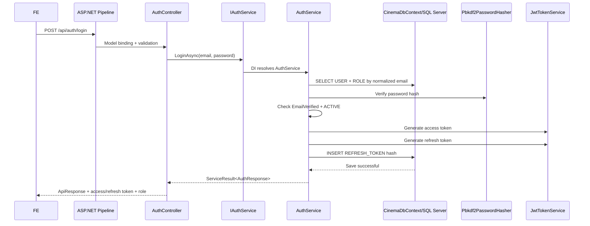

# API, phân quyền, nghiệp vụ và luồng chạy của CinemaSystem

## 1. Phạm vi tài liệu

Tài liệu này mô tả code thực tế trên nhánh `main`, tại baseline `a49bc85`
(đã chứa `origin/main` đến `7dec708`).

Nguồn đối chiếu chính:

- Route và quyền: `CinemaSystem/Controllers`.
- Middleware, JWT và policy: `CinemaSystem/Program.cs`.
- Interface use case: `CinemaSystem.Application/Interfaces`.
- Nghiệp vụ chạy thật: `CinemaSystem.Infrastructure`.
- DTO request/response: `CinemaSystem.Contracts`.
- Entity và trạng thái: `CinemaSystem.Domain`.
- Database: `CinemaSystem.Infrastructure/Persistence/CinemaDbContext.cs`.

Tổng cộng hiện có **65 action HTTP**. Tài liệu phân biệt:

- **Có policy**: quyền đã được khai báo trong `Program.cs`.
- **Có API**: có Controller/action thật để FE gọi.

Hai khái niệm này không đồng nghĩa. Một số policy đã khai báo nhưng chưa có API.

## 2. Kiến trúc tổng quát

```text
FE / Swagger / SePay
        |
        v
Kestrel + ASP.NET Core pipeline (Program.cs)
        |
        +--> GlobalExceptionMiddleware
        +--> CORS / Static files
        +--> Authentication: đọc và kiểm tra JWT
        +--> Authorization: kiểm tra role/policy
        |
        v
Controller trong CinemaSystem/Controllers
        |
        v
Interface trong CinemaSystem.Application/Interfaces
        |
        v
DI mapping trong CinemaSystem.Infrastructure/Extensions/DependencyInjection.cs
        |
        v
Service chạy thật trong CinemaSystem.Infrastructure
        |
        +--> CinemaDbContext --> SQL Server
        +--> ISeatLockStore --> Redis hoặc InMemory
        +--> IEmailSender/IEmailService --> Gmail SMTP hoặc Mock
        +--> IJwtTokenService --> JWT
        +--> Gemini API --> Chatbot/Review moderation
        +--> SePay --> Payment webhook
        +--> wwwroot --> File ảnh
        |
        v
ServiceResult / DTO
        |
        v
ApiResponse { success, message, data, errorCode, errors }
        |
        v
FE / Swagger
```

Nguyên tắc tìm code:

1. Tìm URL trong `CinemaSystem/Controllers`.
2. Xem interface được Controller inject.
3. Mở `DependencyInjection.cs` để biết interface được map sang class nào.
4. Mở service trong `CinemaSystem.Infrastructure`.
5. Từ service, tìm `CinemaDbContext.<DbSet>` để biết bảng được dùng.
6. Xem DTO trong `CinemaSystem.Contracts`.
7. Xem entity/trạng thái trong `CinemaSystem.Domain`.

## 3. Role và policy

### 3.1 Role

| Role trong JWT | Ý nghĩa |
|---|---|
| `CUSTOMER` | Khách hàng đặt vé, thanh toán, đánh giá |
| `STAFF` | Nhân viên tại rạp; hiện mới có một số API đọc phòng/ghế |
| `MANAGER` | Quản lý phim, phòng, ghế, suất chiếu và upload ảnh |
| `ADMIN` | Có quyền Manager và thêm quản lý Staff, review, refund |

Role được lấy từ `USER -> ROLE`, sau đó
`JwtTokenService` đưa role vào JWT. Client không được tự truyền role khi đăng ký.

### 3.2 Policy đã cấu hình và mức độ sử dụng

| Policy | Role | API đang dùng |
|---|---|---|
| `CanBookTicket` | Customer | Booking, lock/unlock ghế, auth-test customer |
| `CanSelectSeat` | Customer, Staff, Manager, Admin | Xem seat map |
| `CanPayOnline` | Customer | Tạo payment |
| `CanReviewAndFeedback` | Customer | Tạo/xem review cá nhân/sửa review |
| `CanManageUserAndRole` | Admin | Tạo Staff |
| `CanManageSystem` | Admin | Duyệt review, auth-test admin |
| `CanScanTicket` | Staff, Manager, Admin | **Chưa có API scan ticket** |
| `CanManageMovie` | Manager, Admin | Đã khai báo nhưng Controller đang dùng `Roles=` trực tiếp |
| `CanManageCinemaRoomSeat` | Manager, Admin | Đã khai báo nhưng Controller đang dùng `Roles=` trực tiếp |
| `CanManageShowtime` | Manager, Admin | Đã khai báo nhưng Controller đang dùng `Roles=` trực tiếp |
| `CanManageFoodAndBeverage` | Staff, Manager, Admin | **Chưa có API CRUD F&B** |
| `CanManageVoucher` | Manager, Admin | **Chưa có API Voucher** |
| `CanCancelShowtimeAndRefund` | Manager, Admin | **Chưa gắn vào action Controller** |
| `CanViewBranchDashboard` | Manager, Admin | **Chưa có API dashboard chi nhánh** |
| `CanViewSystemDashboard` | Admin | **Chưa có API dashboard hệ thống** |
| `CanViewBookingHistory` | Customer | Có policy nhưng API history dùng `[Authorize]`/`CanBookTicket` |
| `CanBuyFoodAndBeverageInCheckout` | Customer | F&B nằm trong booking request; chưa có API riêng |
| `CanApplyVoucher` | Customer | Có policy nhưng chưa có action dùng |
| `CanViewMoviesAndShowtimes` | Mọi người | API public dùng `[AllowAnonymous]` |
| `CanRegisterOrLogin` | Mọi người | Auth API public dùng `[AllowAnonymous]` |

## 4. Chức năng theo từng nhóm người dùng

### 4.1 Khách chưa đăng nhập

Khách chưa đăng nhập có thể:

- Đăng ký, xác minh OTP, đăng nhập thường/Google.
- Refresh token, logout, gửi lại OTP, quên/đặt lại mật khẩu.
- Xem phim, chi tiết phim, tăng lượt xem phim.
- Xem danh sách rạp, thể loại và suất chiếu.
- Xem review đã duyệt.
- Dùng chatbot.
- Xác nhận hoặc từ chối thay đổi giờ chiếu bằng link token trong email.
- Gọi health và DB diagnostic.

Webhook SePay cũng không dùng JWT, nhưng phải có chữ ký HMAC hợp lệ.

### 4.2 Customer

Customer có các nhóm nghiệp vụ:

1. Quản lý profile:
   - Xem/sửa profile.
   - Đổi mật khẩu.
   - Yêu cầu đổi email và xác nhận OTP.
   - Xem lịch sử booking.

2. Chọn ghế:
   - Xem seat map.
   - Lock ghế tạm thời.
   - Unlock ghế do chính mình giữ.

3. Booking:
   - Tạo booking cho suất chiếu.
   - Chọn một hoặc nhiều ghế.
   - Thêm F&B vào booking.
   - Xem booking của mình.
   - Hủy booking đang `PENDING_PAYMENT`.

4. Payment:
   - Tạo giao dịch SePay.
   - Nhận thông tin ngân hàng và mã giao dịch.
   - Khi webhook xác nhận, booking được chuyển sang `PAID` và sinh ticket.

5. Review:
   - Chỉ review booking của chính mình.
   - Chỉ review sau khi đã thanh toán/hoàn tất và suất chiếu đã kết thúc.
   - Mỗi booking chỉ review một lần.
   - Chỉ sửa review một lần.
   - Nội dung đi qua Gemini moderation.

### 4.3 Staff

Staff hiện có API thực tế:

- Xem danh sách phòng.
- Xem chi tiết phòng.
- Xem layout ghế theo phòng.
- Xem seat map theo suất chiếu.
- Dùng các API public.

Policy `CanScanTicket` đã có, nhưng chưa có `TicketController` hoặc API scan/check-in.
Staff cũng chưa có API bán vé tại quầy và chưa có API quản lý F&B.

### 4.4 Manager

Manager hiện có API thực tế:

- Movie:
  - Tạo phim.
  - Sửa phim.
  - Xóa mềm phim.
- Room:
  - Xem danh sách/chi tiết phòng.
  - Tạo, sửa, vô hiệu hóa phòng.
  - Sinh ma trận ghế.
- Seat:
  - Tạo, sửa, xóa mềm ghế.
  - Xem danh sách/chi tiết/layout ghế.
  - Xem seat map.
- Showtime:
  - Tạo, sửa, đổi phòng, xóa/hủy suất chiếu.
- Upload ảnh.
- Dùng các API public.

Manager **chưa có API thực tế** cho:

- Dashboard doanh thu chi nhánh.
- Ticket overview.
- Scan ticket.
- CRUD F&B.
- CRUD Voucher.
- Danh sách/xác nhận refund.
- Tạo/quản lý tài khoản nhân viên.

Quan trọng: các service Movie/Room/Seat/Showtime hiện **chưa lọc theo
`STAFF_PROFILE.cinemaId`**. Nghĩa là Manager có JWT role `MANAGER` có thể gọi
API với ID thuộc rạp khác nếu biết ID. Đây là khoảng trống scope cần xử lý.

### 4.5 Admin

Admin có toàn bộ API quản lý mà Manager có, đồng thời có thêm:

- Tạo tài khoản Staff.
- Xem danh sách refund.
- Xác nhận refund.
- Duyệt review bị AI flag/reject.
- API test policy Admin.

Admin chưa có:

- API tạo Manager.
- API dashboard hệ thống.
- API quản lý role tổng quát.
- API quản lý rạp Cinema CRUD.

### 4.6 Các nghiệp vụ chính và chuỗi gọi hàm

Phần này trả lời trực tiếp ba câu hỏi khi đọc code:

1. Nghiệp vụ bắt đầu ở action nào?
2. Action gọi method nào ở class nào?
3. Xử lý xong đi tiếp đến đâu và trả về theo đường nào?

Quy tắc trả kết quả chung:

```text
Infrastructure service
  -> trả ServiceResult<T> cho interface
  -> Controller nhận result
  -> ToActionResult hoặc code trong action bọc ApiResponse<T>
  -> ASP.NET Core serialize JSON
  -> FE nhận response
```

Ngoại lệ chưa được service chuyển thành `ServiceResult` sẽ đi ngược lên
`GlobalExceptionMiddleware.InvokeAsync`, sau đó middleware đổi thành
`ApiResponse.Fail`.

#### Nghiệp vụ 1 — Xác thực và tài khoản

| Chức năng | Điểm bắt đầu | Hàm nghiệp vụ chạy thật | Hàm/class được gọi tiếp | Đích cuối |
|---|---|---|---|---|
| Đăng ký Customer | `AuthController.Register` | `AuthService.RegisterCustomerAsync` | `PasswordValidator.Validate`; `IPasswordHasher.HashSecret`; `IOtpGenerator.GenerateSixDigitOtp`; `IEmailSender.SendEmailAsync` | `USER`, `ROLE`, `CUSTOMER_PROFILE`, `EMAIL_VERIFICATION_TOKEN`, SMTP |
| Xác minh email | `AuthController.VerifyEmail` | `AuthService.VerifyEmailAsync` | `IPasswordHasher.VerifySecret`; `CinemaDbContext.SaveChangesAsync` | OTP thành used, `USER.EmailVerified=true`, `USER.Status=ACTIVE` |
| Login thường | `AuthController.Login` | `AuthService.LoginAsync` | `IPasswordHasher.VerifySecret`; `JwtTokenService.GenerateAccessToken`; `JwtTokenService.GenerateRefreshToken` | Đọc `USER + ROLE`, ghi `REFRESH_TOKEN` |
| Login Google | `AuthController.GoogleLogin` | `AuthService.GoogleLoginAsync` | `GoogleJsonWebSignature.ValidateAsync`; nếu user mới thì tạo Customer; sau đó gọi `JwtTokenService` | Google API, `USER`, `CUSTOMER_PROFILE`, `REFRESH_TOKEN` |
| Refresh token | `AuthController.RefreshToken` | `AuthService.RefreshTokenAsync` | Hash token; revoke token cũ; `JwtTokenService.GenerateAccessToken/GenerateRefreshToken` | Rotate `REFRESH_TOKEN` |
| Logout | `AuthController.Logout` | `AuthService.LogoutAsync` | Hash token; tìm token; `SaveChangesAsync` | Đánh dấu refresh token revoked |
| Gửi lại OTP | `AuthController.ResendVerificationOtp` | `AuthService.ResendVerificationOtpAsync` | `SendVerificationOtpAsync`; `IOtpGenerator`; `IEmailSender` | OTP hash mới và email |
| Quên mật khẩu | `AuthController.ForgotPassword` | `AuthService.ForgotPasswordAsync` | `IOtpGenerator`; `IPasswordHasher.HashSecret`; `IEmailSender.SendEmailAsync` | Token purpose `PASSWORD_RESET` |
| Đặt lại mật khẩu | `AuthController.ResetPassword` | `AuthService.ResetPasswordAsync` | `PasswordValidator.Validate`; `IPasswordHasher.VerifySecret/HashSecret` | Đổi password hash và revoke refresh token |

Ví dụ đường gọi Login đầy đủ:

```text
POST /api/auth/login
  -> Authentication middleware không yêu cầu JWT vì [AllowAnonymous]
  -> ApiController model binding + data annotation validation
  -> AuthController.Login(...)
  -> IAuthService.LoginAsync(...)
  -> DI chọn CinemaSystem.Infrastructure.Auth.AuthService
  -> AuthService.LoginAsync(...)
      -> CinemaDbContext.Users.Include(Role)
      -> Pbkdf2PasswordHasher.VerifySecret(...)
      -> JwtTokenService.GenerateAccessToken(...)
      -> JwtTokenService.GenerateRefreshToken()
      -> CinemaDbContext.RefreshTokens.Add(...)
      -> CinemaDbContext.SaveChangesAsync(...)
  -> ServiceResult<AuthResponse>
  -> AuthController.ToActionResult(...)
  -> ApiResponse<AuthResponse>
  -> FE
```

#### Nghiệp vụ 2 — Hồ sơ Customer

| Chức năng | Action | Interface method | Class/method chạy thật | Xử lý tiếp |
|---|---|---|---|---|
| Xem profile | `CustomersController.GetProfile` | `ICustomerService.GetProfileAsync` | `CustomerService.GetProfileAsync` | Đọc `USER + CUSTOMER_PROFILE` rồi map `CustomerProfileResponse` |
| Sửa profile | `CustomersController.UpdateProfile` | `ICustomerService.UpdateProfileAsync` | `CustomerService.UpdateProfileAsync` | Gán field hợp lệ, `CinemaDbContext.SaveChangesAsync` |
| Đổi mật khẩu | `CustomersController.ChangePassword` | `ICustomerService.ChangePasswordAsync` | `CustomerService.ChangePasswordAsync` | `IPasswordHasher.VerifySecret`; `PasswordValidator.Validate`; `HashSecret` |
| Yêu cầu đổi email | `CustomersController.RequestEmailChange` | `ICustomerService.RequestEmailUpdateAsync` | `CustomerService.RequestEmailUpdateAsync` | Gọi private `SendUpdateOtpAsync`; ghi OTP; `IEmailSender.SendEmailAsync` |
| Xác nhận email mới | `CustomersController.VerifyEmailChange` | `ICustomerService.VerifyEmailUpdateAsync` | `CustomerService.VerifyEmailUpdateAsync` | Verify OTP hash; cập nhật `USER.Email` |
| Lịch sử booking | `CustomersController.GetBookingHistory` | `ICustomerService.GetBookingHistoryAsync` | `CustomerService.GetBookingHistoryAsync` | Query Customer → Booking → Showtime → Movie/Room/Cinema → Seat |

Tất cả action trước tiên gọi `CustomersController.GetUserId()` để lấy
`ClaimTypes.NameIdentifier`. Nếu không có claim thì dừng ở 401, chưa gọi service.

#### Nghiệp vụ 3 — Phim, thể loại và rạp

| Chức năng | Action | Interface method | Class/method chạy thật | Hàm/class gọi tiếp |
|---|---|---|---|---|
| Danh sách phim | `MoviesController.GetMovies` | `IMovieService.GetMoviesAsync` | `MovieService.GetMoviesAsync` | LINQ trên `CinemaDbContext.Movies`, genre/language; trả `PagedList` |
| Chi tiết phim | `MoviesController.GetMovieById` | `IMovieService.GetMovieByIdAsync` | `MovieService.GetMovieByIdAsync` | Private query/load và map `MovieDetailResponse` |
| Tăng lượt xem | `MoviesController.IncrementMovieView` | `IMovieService.IncrementMovieViewAsync` | `MovieService.IncrementMovieViewAsync` | Cập nhật Movie, `MOVIE_VIEW_LOG`, `MOVIE_DAILY_VIEW` |
| Tạo phim | `MoviesController.CreateMovie` | `IMovieService.CreateMovieAsync` | `MovieService.CreateMovieAsync` | Validate; `IFileStorageService.SaveFileAsync` nếu có poster; ghi Movie/MovieGenre |
| Sửa phim | `MoviesController.UpdateMovie` | `IMovieService.UpdateMovieAsync` | `MovieService.UpdateMovieAsync` | Kiểm showtime trước khi đổi duration; thay poster; `SaveChangesAsync` |
| Xóa phim | `MoviesController.DeleteMovie` | `IMovieService.DeleteMovieAsync` | `MovieService.DeleteMovieAsync` | Nếu có showtime mở: `IAdminRefundService.CancelShowtimesAndRefundAsync`; sau đó xóa mềm Movie |
| Danh mục thể loại | `GenresController.GetGenres` | `IGenreService.GetAllGenresAsync` | `GenreService.GetAllGenresAsync` | `CinemaDbContext.Genres.Select(...)` |
| Danh sách rạp | `CinemasController.GetCinemas` | `ICinemaService.GetCinemasAsync` | `CinemaService.GetCinemasAsync` | `CinemaDbContext.Cinemas` |

Luồng lưu poster của API Movie:

```text
MoviesController mở IFormFile thành Stream
  -> MovieService.CreateMovieAsync/UpdateMovieAsync
  -> IFileStorageService
  -> DI chọn LocalFileStorageService
  -> LocalFileStorageService.SaveFileAsync
  -> file vào wwwroot/uploads/posters
  -> URL được gán vào MOVIE.posterUrl
```

#### Nghiệp vụ 4 — Phòng và ghế vật lý

| Chức năng | Action | Interface method | Class/method chạy thật | Xử lý tiếp |
|---|---|---|---|---|
| Danh sách phòng | `RoomsController.GetRooms` | `IRoomService.GetRoomsAsync` | `RoomService.GetRoomsAsync` | Query `ROOM + CINEMA + SEAT` |
| Chi tiết phòng | `RoomsController.GetRoomById` | `IRoomService.GetRoomByIdAsync` | `RoomService.GetRoomByIdAsync` | Lọc inactive theo query |
| Tạo phòng | `RoomsController.CreateRoom` | `IRoomService.CreateRoomAsync` | `RoomService.CreateRoomAsync` | Kiểm Cinema/status; thêm `ROOM`; save |
| Sửa phòng | `RoomsController.UpdateRoom` | `IRoomService.UpdateRoomAsync` | `RoomService.UpdateRoomAsync` | Kiểm tên/capacity; nếu maintenance/inactive thì showtime mở sang `SUSPENDED` |
| Xóa phòng | `RoomsController.DeleteRoom` | `IRoomService.DeleteRoomAsync` | `RoomService.DeleteRoomAsync` | Xóa mềm `ROOM=INACTIVE`; showtime mở sang `SUSPENDED` |
| Sinh ghế | `RoomsController.GenerateSeats` | `IRoomService.GenerateSeatsAsync` | `RoomService.GenerateSeatsAsync` | Tạo `SEAT` A1... theo hàng/cột; cập nhật capacity |
| Tạo ghế đơn | `SeatsController.CreateSeatRequest` | `ISeatService.CreateSeatAsync` | `SeatService.CreateSeatAsync` | Kiểm Room/SeatType/trùng mã; thêm `SEAT` |
| Sửa ghế | `SeatsController.UpdateSeat` | `ISeatService.UpdateSeatAsync` | `SeatService.UpdateSeatAsync` | Kiểm ghế/trùng mã; save |
| Xóa ghế | `SeatsController.DeleteSeat` | `ISeatService.DeleteSeatAsync` | `SeatService.DeleteSeatAsync` | Kiểm liên kết; xóa mềm `IsActive=false` |
| Đọc ghế | Các action GET của `SeatsController` | Các method `GetSeats*Async` | Các method tương ứng trong `SeatService` | Query `SEAT`, `ROOM`, `SEAT_TYPE` |

#### Nghiệp vụ 5 — Lock ghế và seat map

Luồng lock:

```text
SeatsController.LockSeat
  -> ISeatService.LockSeatAsync
  -> SeatService.LockSeatAsync
      -> query SHOWTIME_SEAT + BOOKING_SEAT
      -> kiểm ghế chưa sold/locked
      -> ISeatLockStore.TryLockAsync(lockKey, userId, ttl)
          -> RedisSeatLockStore.TryLockAsync nếu có Redis:ConnectionString
          -> InMemorySeatLockStore.TryLockAsync nếu không có Redis
      -> cập nhật SHOWTIME_SEAT:
           SeatStatus=LOCKED
           LockedByUserId=userId
           LockedUntil=...
      -> CinemaDbContext.SaveChangesAsync
  -> LockSeatResponse
```

Nếu `SaveChangesAsync` lỗi sau khi cache đã lock, `SeatService` gọi
`ISeatLockStore.ReleaseAsync` để rollback lock ngoài DB.

Luồng unlock:

```text
SeatsController.UnlockSeat
  -> SeatService.UnlockSeatAsync
  -> kiểm đúng chủ lock
  -> ISeatLockStore.ReleaseAsync
  -> SHOWTIME_SEAT về AVAILABLE
  -> SaveChangesAsync
```

Luồng seat map:

```text
SeatsController.GetSeatMap
  -> SeatService.GetSeatMapAsync
  -> private ReleaseExpiredLocksAsync
  -> query SHOWTIME_SEAT + BOOKING_SEAT + SEAT + SEAT_TYPE
  -> phân loại AvailableSeats / LockedSeats / SoldSeats
  -> SeatMapResponse
```

#### Nghiệp vụ 6 — Suất chiếu

| Chức năng | Action | Interface method | Class/method chạy thật | Hàm/class gọi tiếp |
|---|---|---|---|---|
| Danh sách | `ShowtimesController.GetShowtimes` | `IShowtimeService.GetShowtimesAsync` | `ShowtimeService.GetShowtimesAsync` | Query Showtime/Movie/Room/Cinema |
| Chi tiết | `ShowtimesController.GetShowtimeById` | `IShowtimeService.GetShowtimeByIdAsync` | `ShowtimeService.GetShowtimeByIdAsync` | Private `LoadShowtimeAsync` |
| Tạo | `ShowtimesController.CreateShowtime` | `IShowtimeService.CreateShowtimeAsync` | `ShowtimeService.CreateShowtimeAsync` | `ValidateMovieRoomAndOverlapAsync`; `CreateShowtimeSeat`; save |
| Sửa | `ShowtimesController.UpdateShowtime` | `IShowtimeService.UpdateShowtimeAsync` | `ShowtimeService.UpdateShowtimeAsync` | Validate; xử lý booking; Hangfire `IEmailService.SendEmailAsync` |
| Đổi phòng | `ShowtimesController.ChangeRoom` | `IShowtimeService.ChangeRoomAsync` | `ShowtimeService.ChangeRoomAsync` | Map ghế cũ/mới; cập nhật BookingSeat; gửi email |
| Xóa/hủy | `ShowtimesController.DeleteShowtime` | `IShowtimeService.DeleteShowtimeAsync` | `ShowtimeService.DeleteShowtimeAsync` | Không booking: xóa cứng; có booking: private `CancelShowtimeAndTriggerRefundsAsync` |

`ValidateMovieRoomAndOverlapAsync` là điểm tập trung các rule:

- Movie tồn tại/hoạt động.
- Room/Cinema hoạt động.
- Start time đủ xa hiện tại.
- Tính end time từ duration phim.
- Không overlap showtime khác, kể cả cleaning buffer.

#### Nghiệp vụ 7 — Booking

| Chức năng | Action | Interface method | Class/method chạy thật | Xử lý tiếp |
|---|---|---|---|---|
| Tạo booking | `BookingsController.CreateBooking` | `IBookingService.CreateBookingAsync` | `BookingService.CreateBookingAsync` | Customer → Showtime → ShowtimeSeat → SeatType/F&B; tạo Booking/BookingSeat |
| Chi tiết booking | `BookingsController.GetBookingDetails` | `IBookingService.GetBookingDetailsAsync` | `BookingService.GetBookingDetailsAsync` | Kiểm chủ booking; load Seat/F&B/Ticket |
| Booking của tôi | `BookingsController.GetMyBookings` | `IBookingService.GetMyBookingsAsync` | `BookingService.GetMyBookingsAsync` | Query theo CustomerProfile của JWT user |
| Xác nhận đổi giờ | `BookingsController.ConfirmTimeChange` | `IBookingService.ConfirmTimeChangeAsync` | `BookingService.ConfirmTimeChangeAsync` | HMAC token; accept về `PAID`, reject tạo `REFUND` |
| Hủy booking | `BookingsController.CancelBooking` | `IBookingService.CancelBookingAsync` | `BookingService.CancelBookingAsync` | Kiểm chủ/status; release ghế; booking `CANCELLED` |

Luồng `CreateBookingAsync` kết thúc bằng:

```text
CinemaDbContext.Bookings.Add(booking)
  -> EF cascade thêm BOOKING_SEAT và BOOKING_FB_ITEM
  -> SHOWTIME_SEAT được đặt LOCKED
  -> CinemaDbContext.SaveChangesAsync
  -> ServiceResult<BookingResponse>
  -> BookingsController
```

Bước nghiệp vụ tiếp theo sau khi tạo booking không được gọi tự động trong cùng
method. FE phải gọi `PaymentController.CreatePayment`.

#### Nghiệp vụ 8 — Thanh toán và sinh ticket

```text
PaymentController.CreatePayment
  -> IPaymentService.CreatePaymentAsync
  -> PaymentService.CreatePaymentAsync
      -> query BOOKING + CUSTOMER_PROFILE + PAYMENT
      -> kiểm booking thuộc user và PENDING_PAYMENT
      -> query PAYMENT_PROVIDER và kiểm ACTIVE
      -> reuse PAYMENT PENDING hoặc tạo PAYMENT mới
      -> CinemaDbContext.SaveChangesAsync
  -> CreatePaymentResponse
      -> PaymentId
      -> Amount
      -> TransactionCode
      -> BankName/BankAccount
      -> ExpiresAt
```

Sau khi Customer chuyển khoản, SePay gọi chuỗi khác:

```text
PaymentController.SepayWebhook
  -> IPaymentWebhookService.HandleSepayWebhookAsync
  -> PaymentWebhookService.HandleSepayWebhookAsync
      -> IWebhookSignatureVerifier.Verify
      -> DI chọn HmacVerifyHelper.Verify
      -> JsonSerializer.Deserialize<SepayWebhookRequest>
      -> IPaymentService.ConfirmPaymentAsync
      -> PaymentService.ConfirmPaymentAsync
          -> lấy transaction code bằng Regex
          -> query PAYMENT + BOOKING + BOOKING_SEAT + SHOWTIME_SEAT + TICKET
          -> kiểm đúng amount
          -> BeginTransactionAsync
          -> PAYMENT=SUCCESS
          -> BOOKING=PAID
          -> SHOWTIME_SEAT=BOOKED
          -> tạo TICKET nếu chưa có
          -> SaveChangesAsync
          -> CommitAsync
  -> PaymentController trả ACK cho SePay
```

Nếu payment đến sau khi booking/showtime đã bị hủy,
`PaymentService.ConfirmPaymentAsync` gọi tiếp logic tạo entity `Refund`, chuyển
booking sang `REFUND_PENDING`, commit và dừng trước bước sinh ticket.

#### Nghiệp vụ 9 — Hủy suất chiếu và hoàn tiền

Có hai đường tạo refund:

1. Hủy/xóa một showtime:

```text
ShowtimesController.DeleteShowtime
  -> ShowtimeService.DeleteShowtimeAsync
  -> private ShowtimeService.CancelShowtimeAndTriggerRefundsAsync
  -> SHOWTIME=CANCELLED
  -> release SHOWTIME_SEAT
  -> BOOKING đã PAID/COMPLETED thành REFUND_PENDING
  -> tạo SHOWTIME_CANCELLATION + REFUND
  -> Hangfire -> IEmailService.SendEmailAsync
```

2. Xóa phim có nhiều showtime mở:

```text
MoviesController.DeleteMovie
  -> MovieService.DeleteMovieAsync
  -> IAdminRefundService.CancelShowtimesAndRefundAsync
  -> AdminRefundService.CancelShowtimesAndRefundAsync
  -> transaction hủy danh sách showtime, booking, ghế, ticket và tạo refund
  -> quay lại MovieService
  -> MovieService xóa mềm Movie
```

Admin xử lý phần cuối:

```text
AdminRefundsController.GetRefunds
  -> IAdminRefundService.GetRefundsAsync
  -> AdminRefundService.GetRefundsAsync
  -> query REFUND + BOOKING + CUSTOMER + SHOWTIME + MOVIE + ROOM

AdminRefundsController.ConfirmRefund
  -> IAdminRefundService.ConfirmRefundAsync
  -> AdminRefundService.ConfirmRefundAsync
  -> BOOKING REFUND_PENDING -> REFUNDED
  -> REFUND PENDING -> SUCCESS
  -> SaveChangesAsync
```

#### Nghiệp vụ 10 — Review và AI moderation

```text
ReviewsController.CreateReview
  -> IReviewService.CreateReviewAsync
  -> ReviewService.CreateReviewAsync
      -> query USER + CUSTOMER_PROFILE
      -> query BOOKING + SHOWTIME
      -> kiểm đúng Customer, Movie, trạng thái và showtime đã kết thúc
      -> kiểm chưa review booking này
      -> private HandleModerationAsync
          -> IAiModerationService.ModerateReviewAsync
          -> GeminiModerationService.ModerateReviewAsync
          -> Google Gemini API
      -> ghi REVIEW + REVIEW_MODERATION_HISTORY
      -> IMovieService.UpdateMovieRatingAsync nếu được approved
      -> MovieService.UpdateMovieRatingAsync
  -> ReviewResponse
```

Sửa review:

```text
ReviewsController.EditReview
  -> ReviewService.EditReviewAsync
  -> kiểm chủ review và edit count
  -> ghi REVIEW_EDIT_HISTORY
  -> moderation lại
  -> cập nhật rating Movie nếu trạng thái/rating thay đổi
```

Admin duyệt:

```text
ReviewsController.AdminApproveReview
  -> ReviewService.AdminApproveReviewAsync
  -> REVIEW=APPROVED
  -> ghi REVIEW_MODERATION_HISTORY
  -> MovieService.UpdateMovieRatingAsync
```

#### Nghiệp vụ 11 — Admin tạo Staff

```text
AdminController.CreateStaff
  -> IAdminService.CreateStaffAsync
  -> AdminService.CreateStaffAsync
      -> kiểm email chưa tồn tại
      -> query Cinema đầu tiên
      -> query ROLE_STAFF
      -> IOtpGenerator.GenerateSixDigitOtp
      -> IPasswordHasher.HashSecret
      -> thêm USER + STAFF_PROFILE + EMAIL_VERIFICATION_TOKEN
      -> CinemaDbContext.SaveChangesAsync
      -> IBackgroundJobClient.Enqueue<IEmailService>
      -> IEmailService.SendInvitationAsync
  -> ServiceResult 201
  -> AdminController.ToActionResult
```

#### Nghiệp vụ 12 — Chatbot, upload và vận hành nền

Chatbot:

```text
ChatbotController.Ask
  -> IChatbotService.AskAsync
  -> GeminiChatbotService.AskAsync
      -> IMovieService.GetMoviesAsync
      -> MovieService.GetMoviesAsync
      -> IShowtimeService.GetShowtimesAsync
      -> ShowtimeService.GetShowtimesAsync
      -> ghép context phim/suất chiếu
      -> HttpClient.PostAsJsonAsync tới Gemini
      -> tạo ChatHistory
      -> CinemaDbContext.ChatHistories.Add
      -> SaveChangesAsync
  -> ChatbotResponse
```

Upload:

```text
UploadController.UploadImage
  -> kiểm file, extension
  -> FileStream.CopyToAsync
  -> wwwroot/images
  -> trả URL /images/{fileName}
```

Upload này xử lý trực tiếp trong Controller, không gọi Application interface.

Job dọn booking:

```text
Program.cs AddHostedService<PendingPaymentCleanupHostedService>
  -> PendingPaymentCleanupHostedService.ExecuteAsync
  -> private CleanupExpiredBookingsAsync
  -> query booking PENDING_PAYMENT hết hạn
  -> release SHOWTIME_SEAT
  -> PAYMENT PENDING -> EXPIRED
  -> BOOKING -> CANCELLED
  -> SaveChangesAsync
```

Job phân loại phim:

```text
DependencyInjection.AddHostedService<MovieHighlightClassificationJob>
  -> MovieHighlightClassificationJob.ExecuteAsync
  -> query MOVIE
  -> tính POPULAR/COMING_SOON/NEW/HOT/TRENDING
  -> SaveChangesAsync
  -> Task.Delay 1 giờ
```

## 5. Danh sách đầy đủ 65 API

Quy ước:

- `Public`: không cần JWT.
- `Auth`: chỉ yêu cầu JWT hợp lệ, không khóa role cụ thể.
- `Customer`, `Staff`, `Manager`, `Admin`: role được kiểm tra bởi policy/attribute.

### 5.1 Authentication — 9 API

| Method | Route | Quyền | Input chính | Nghiệp vụ và đích gọi |
|---|---|---|---|---|
| POST | `/api/auth/register` | Public | `email`, `password`, `fullName`, `phoneNumber?` | `AuthController -> IAuthService -> AuthService`; tạo `USER`, `CUSTOMER_PROFILE`, OTP hash; gửi email |
| POST | `/api/auth/verify-email` | Public | `email`, `otp` | Xác minh OTP chưa dùng/chưa hết hạn; chuyển user sang `ACTIVE` |
| POST | `/api/auth/login` | Public | `email`, `password` | Kiểm password, email verified, trạng thái; sinh access/refresh token |
| POST | `/api/auth/google-login` | Public | `idToken` | Xác minh Google token; nếu chưa có user thì tạo Customer; sinh token |
| POST | `/api/auth/refresh-token` | Public | `refreshToken` | Kiểm hash/token/revoke/expiry; revoke token cũ và rotate token mới |
| POST | `/api/auth/logout` | Public | `refreshToken` | Revoke refresh token; luôn trả thành công để tránh lộ token tồn tại |
| POST | `/api/auth/resend-verification-otp` | Public | `email` | Kiểm cooldown/send limit; tạo OTP mới; gửi email |
| POST | `/api/auth/forgot-password` | Public | `email` | Tạo OTP purpose `PASSWORD_RESET`; gửi email |
| POST | `/api/auth/reset-password` | Public | `email`, `otp`, `newPassword` | Kiểm OTP; hash password mới; revoke refresh token còn hiệu lực |

### 5.2 Customer profile — 6 API

Base Controller dùng `[Authorize]`, nên về kỹ thuật mọi role có JWT đều vào được
Controller. Một số service vẫn yêu cầu `CUSTOMER_PROFILE`.

| Method | Route | Quyền thực tế | Nghiệp vụ và đích gọi |
|---|---|---|---|
| GET | `/api/customer/profile` | Auth | `CustomerService` đọc `USER + CUSTOMER_PROFILE` |
| PUT | `/api/customer/profile` | Auth | Cập nhật họ tên, địa chỉ, avatar, giới tính, ngày sinh |
| POST | `/api/customer/change-password` | Auth | Kiểm password cũ, policy password mới, lưu hash mới |
| POST | `/api/customer/request-email-change` | Auth | Kiểm email trùng, tạo OTP hash, gửi email |
| POST | `/api/customer/verify-email-change` | Auth | Kiểm OTP/expiry/purpose rồi cập nhật `USER.email` |
| GET | `/api/customer/bookings` | Auth | Dựng lịch sử từ booking, phim, rạp, phòng và ghế |

### 5.3 Movie — 6 API

| Method | Route | Quyền | Input/query | Nghiệp vụ và đích gọi |
|---|---|---|---|---|
| GET | `/api/movies` | Public | `status?`, `genre?`, `pageIndex=1`, `pageSize=10` | Lọc/phân trang phim; Manager/Admin có thể thấy dữ liệu xóa |
| GET | `/api/movies/{movieId}` | Public | `movieId` | Chi tiết phim, genre, language, rating, poster |
| POST | `/api/movies/{movieId}/view` | Public | `movieId` | Tăng view và ghi log/daily view |
| POST | `/api/movies` | Manager, Admin | multipart `CreateMovieRequest`, `posterFile?` | Validate duration/title/rating/language/genre/date; lưu poster và phim |
| PUT | `/api/movies/{movieId}` | Manager, Admin | multipart `UpdateMovieRequest`, `posterFile?` | Cập nhật phim; không cho đổi duration nếu đã có showtime |
| DELETE | `/api/movies/{movieId}` | Manager, Admin | `movieId` | Hủy showtime đang mở qua `IAdminRefundService`, sau đó xóa mềm phim |

`MovieService` dùng các bảng `MOVIE`, `MOVIE_GENRE`, `GENRE`, `LANGUAGE`,
`MOVIE_VIEW_LOG`, `MOVIE_DAILY_VIEW`.

### 5.4 Genre và Cinema — 2 API

| Method | Route | Quyền | Nghiệp vụ và đích gọi |
|---|---|---|---|
| GET | `/api/genres` | Public | `GenreService -> CinemaDbContext.Genres -> GENRE` |
| GET | `/api/cinemas` | Public | `CinemaService -> CinemaDbContext.Cinemas -> CINEMA` |

Hiện chưa có API Cinema CRUD.

### 5.5 Room — 6 API

Lưu ý base route là `/api/rooms`, nên các action có segment `rooms` tạo URL
`/api/rooms/rooms`.

| Method | Route | Quyền | Input/query | Nghiệp vụ |
|---|---|---|---|---|
| GET | `/api/rooms/rooms` | Staff, Manager, Admin | `includeInactive=false` | Danh sách phòng, rạp và số ghế |
| GET | `/api/rooms/rooms/{roomId}` | Staff, Manager, Admin | `includeInactive=false` | Chi tiết phòng |
| POST | `/api/rooms/cinemas/{cinemaId}/rooms` | Manager, Admin | `roomName`, `capacity`, `roomStatus` | Tạo phòng thuộc rạp |
| PUT | `/api/rooms/rooms/{roomId}` | Manager, Admin | thông tin phòng mới | Kiểm trạng thái/tên trùng/capacity; suspend showtime nếu maintenance/inactive |
| DELETE | `/api/rooms/rooms/{roomId}` | Manager, Admin | `roomId` | Xóa mềm: phòng `INACTIVE`, showtime mở chuyển `SUSPENDED` |
| POST | `/api/rooms/{roomId}/generate-seats` | Manager, Admin | `rows`, `columns`, `seatTypeId` | Sinh ghế A1...; không chạy nếu phòng đã có ghế |

Giới hạn số ghế lấy từ `CinemaProcessingSettings:MaxRoomCapacity`.

### 5.6 Seat — 9 API

| Method | Route | Quyền | Input/query | Nghiệp vụ |
|---|---|---|---|---|
| POST | `/api/seats` | Manager, Admin | `roomId`, `rowLabel`, `seatNumber`, `seatTypeId` | Tạo ghế, kiểm room/seat type/trùng mã |
| PUT | `/api/seats/{seatId}` | Manager, Admin | dữ liệu ghế mới | Cập nhật ghế và kiểm trùng |
| DELETE | `/api/seats/{seatId}` | Manager, Admin | `seatId` | Xóa mềm nếu không vi phạm liên kết suất chiếu |
| GET | `/api/seats/room/{roomId}` | Staff, Manager, Admin | `roomId` | Layout ghế theo phòng |
| GET | `/api/seats` | Manager, Admin | `roomId?`, `isActive?`, paging | Danh sách ghế phân trang |
| GET | `/api/seats/{seatId}` | Manager, Admin | `seatId` | Chi tiết ghế |
| POST | `/api/seats/lock` | Customer | `showtimeId`, `seatId` | Lock Redis/InMemory trước, sau đó ghi `SHOWTIME_SEAT=LOCKED` |
| POST | `/api/seats/unlock` | Customer | `showtimeId`, `seatId` | Chỉ chủ lock được mở; giải phóng store và DB |
| GET | `/api/seats/showtimes/{showtimeId}/map` | Customer, Staff, Manager, Admin | `showtimeId` | Release lock hết hạn; chia ghế thành available/locked/sold |

TTL lock hiện lấy từ `BookingSettings:PendingPaymentExpiryMinutes`.

### 5.7 Showtime — 6 API

| Method | Route | Quyền | Input/query | Nghiệp vụ |
|---|---|---|---|---|
| GET | `/api/showtimes` | Public | Không | Danh sách showtime kèm phim/phòng/rạp/số ghế |
| GET | `/api/showtimes/{showtimeId}` | Public | `showtimeId` | Chi tiết showtime |
| POST | `/api/showtimes` | Manager, Admin | `movieId`, `roomId`, `startTime`, `basePrice`, `status` | Kiểm phim/phòng, overlap, cleaning buffer; sinh `SHOWTIME_SEAT` |
| PUT | `/api/showtimes/{showtimeId}` | Manager, Admin | request + `force=false` | Cập nhật; xử lý booking bị ảnh hưởng và gửi email |
| POST | `/api/showtimes/{showtimeId}/change-room` | Manager, Admin | `newRoomId`, `seatMapping?` | Map ghế đã bán sang phòng mới; cập nhật booking seat; gửi email |
| DELETE | `/api/showtimes/{showtimeId}` | Manager, Admin | `showtimeId` | Không booking: xóa cứng; có booking: hủy mềm và tạo refund |

Rule chính:

- Không tạo showtime quá sát giờ bắt đầu theo `PreShowtimeBlockingMinutes`.
- Phòng/rạp phải active và phòng phải có ghế active.
- End time = start time + duration phim.
- Kiểm tra trùng lịch cùng phòng và thời gian vệ sinh.
- Không hủy showtime đã hoàn tất hoặc trong quá khứ.
- Nếu cập nhật giờ/phòng ảnh hưởng booking đã thanh toán, booking/showtime có thể
  sang `PROCESSING_UNSTABLE`; khách được gửi email xác nhận.
- Nếu đổi giờ từ 15 phút trở lên, email có link
  `/api/bookings/{bookingId}/confirm-time-change`.

### 5.8 Booking — 5 API

| Method | Route | Quyền | Input/query | Nghiệp vụ |
|---|---|---|---|---|
| POST | `/api/bookings` | Customer | `showtimeId`, `showtimeSeatIds`, `voucherCode?`, `foodAndBeverages?` | Tạo booking `PENDING_PAYMENT`, tính ghế/F&B, giữ ghế |
| GET | `/api/bookings/{bookingId}` | Customer | `bookingId` | Chỉ chủ booking được xem chi tiết |
| GET | `/api/bookings/my-bookings` | Customer | Không | Danh sách booking của user hiện tại |
| GET | `/api/bookings/{bookingId}/confirm-time-change` | Public + token | `accept`, `token` | Đồng ý giờ mới hoặc từ chối để tạo refund |
| POST | `/api/bookings/{bookingId}/cancel` | Customer | `bookingId` | Chỉ chủ booking và chỉ khi `PENDING_PAYMENT` |

Luồng tạo booking:

1. JWT cho `userId`.
2. Tìm `CUSTOMER_PROFILE`.
3. Tìm showtime và kiểm tra chưa hủy/đóng/chưa bắt đầu.
4. Tìm đúng `SHOWTIME_SEAT`.
5. Chặn ghế đã bán hoặc đang lock bởi user khác.
6. Tính giá ghế = `SHOWTIME.basePrice + SEAT_TYPE.extraFee`.
7. Tính F&B = giá món × số lượng.
8. Tạo `BOOKING`, `BOOKING_SEAT`, `BOOKING_FB_ITEM`.
9. Đặt booking `PENDING_PAYMENT`, hạn hiện tại là 10 phút.
10. Đặt ghế thành `LOCKED` tới hạn booking.

Điểm chưa hoàn thiện:

- `VoucherCode` có trong DTO nhưng `BookingService` hiện không đọc/áp dụng voucher.
- F&B item không tìm thấy hiện bị bỏ qua thay vì trả lỗi.
- Chưa có API lấy danh mục F&B cho FE.

### 5.9 Payment — 2 API

| Method | Route | Quyền | Input/header | Nghiệp vụ |
|---|---|---|---|---|
| POST | `/api/payment` | Customer | `bookingId`, `paymentProviderId` | Kiểm chủ booking/provider/trạng thái; tạo/reuse payment `PENDING`; trả thông tin chuyển khoản |
| POST | `/api/payment/sepay-webhook` | Public, HMAC | JSON + `x-sepay-signature`, `x-sepay-timestamp` | Xác minh chữ ký; tìm transaction code; xác nhận tiền; cập nhật booking/ghế/ticket |

Luồng webhook:

1. `PaymentController` nhận raw JSON và header.
2. `PaymentWebhookService` gọi `HmacVerifyHelper`.
3. Parse `SepayWebhookRequest`.
4. Gọi `PaymentService.ConfirmPaymentAsync`.
5. Regex lấy transaction code dạng `T[A-Z0-9]{10}` từ nội dung chuyển khoản.
6. Kiểm tra payment tồn tại và số tiền khớp chính xác.
7. Transaction DB:
   - `PAYMENT -> SUCCESS`.
   - `BOOKING -> PAID`.
   - `SHOWTIME_SEAT -> BOOKED`.
   - Gỡ lock.
   - Sinh `TICKET` cho từng booking seat.
8. Nếu tiền đến sau khi booking/showtime đã hủy:
   - Booking chuyển `REFUND_PENDING`.
   - Tạo `REFUND=PENDING`.
   - Không sinh ticket.

Webhook là idempotent: payment đã `SUCCESS` thì thoát không xử lý lặp.

### 5.10 Review — 5 API

| Method | Route | Quyền | Input | Nghiệp vụ |
|---|---|---|---|---|
| POST | `/api/reviews` | Customer | `movieId`, `bookingId`, `rating`, `comment?` | Kiểm booking và suất chiếu; AI moderation; lưu review/history |
| GET | `/api/reviews/movies/{movieId}` | Public | `movieId` | Chỉ lấy review `APPROVED` |
| GET | `/api/reviews/me` | Customer | Không | Review của Customer hiện tại |
| PUT | `/api/reviews/{reviewId}` | Customer | rating/comment mới | Chỉ chủ review; giới hạn sửa một lần; moderation lại |
| PUT | `/api/reviews/admin/{reviewId}/approve` | Admin | `reviewId` | Admin duyệt thủ công, ghi moderation history, cập nhật rating phim |

Rule review:

- User phải có `CUSTOMER_PROFILE`.
- Booking phải thuộc Customer, đúng phim, đã `PAID/COMPLETED`.
- Showtime phải kết thúc.
- Không review trùng booking.
- Tài khoản bị khóa comment sẽ bị từ chối.
- Gemini trả `APPROVED`, `FLAGGED` hoặc `REJECTED`.
- Thiếu Gemini key/lỗi AI thì review chuyển `FLAGGED` để Admin xử lý.

### 5.11 Admin và refund — 3 API

| Method | Route | Quyền | Input/query | Nghiệp vụ |
|---|---|---|---|---|
| POST | `/api/admin/staff` | Admin | `email`, `fullName?` | Tạo `USER` role Staff, `STAFF_PROFILE`, invitation OTP; gửi email nền |
| GET | `/api/admin/refunds` | Admin | `status=PENDING`, paging | Danh sách refund kèm booking/customer/movie/room |
| POST | `/api/admin/refunds/{bookingId}/confirm` | Admin | `bookingId` | Booking `REFUND_PENDING -> REFUNDED`; refund `PENDING -> SUCCESS` |

Lưu ý nghiệp vụ tạo Staff:

- Email phải chưa tồn tại.
- Role Staff phải tồn tại.
- Service hiện lấy **rạp đầu tiên theo CinemaId**, không nhận `cinemaId` từ request.
- User Staff được tạo `ACTIVE` nhưng `EmailVerified=false`.
- Invitation OTP được lưu với purpose `PASSWORD_RESET`.
- Email được gửi bằng Hangfire.

Refund:

- `AdminRefundService.CancelShowtimesAndRefundAsync` có logic hủy hàng loạt, release
  ghế, tạo refund và gửi email.
- Hiện không có action Controller gọi trực tiếp method hủy hàng loạt.
- Method này được `MovieService.DeleteMovieAsync` gọi khi xóa phim có showtime mở.
- `ShowtimeService.DeleteShowtimeAsync` cũng có luồng hủy/refund riêng.
- Endpoint xác nhận refund chỉ cập nhật `BOOKING` và `REFUND`; không thấy cập nhật
  payment/ticket trong `ConfirmRefundAsync`.

### 5.12 Upload, chatbot và diagnostic — 6 API

| Method | Route | Quyền | Nghiệp vụ |
|---|---|---|---|
| POST | `/api/upload/image` | Manager, Admin | Kiểm extension; lưu vào `wwwroot/images`; trả URL |
| POST | `/api/chatbot` | Public | Lấy movie/showtime làm context; gọi Gemini; lưu `CHAT_HISTORY` với `UserId=null` |
| GET | `/api/health` | Public | Kiểm tra process API còn chạy; không chạm DB |
| GET | `/api/db-test/movies-count` | Public | Query `COUNT(MOVIE)` để kiểm tra DB |
| GET | `/api/auth-test/customer` | Customer | Test policy và trả claims JWT |
| GET | `/api/auth-test/admin` | Admin | Test policy và trả claims JWT |

Upload hiện kiểm extension nhưng chưa thấy giới hạn kích thước file trong Controller.

## 6. Luồng chạy từ lúc ứng dụng khởi động

### 6.1 Startup trong `Program.cs`

Thứ tự chính:

1. Đọc `appsettings`, environment variable và user secrets.
2. Đăng ký Controller, model validation và Swagger.
3. Gọi `AddInfrastructureServices`:
   - Đăng ký `CinemaDbContext` với SQL Server.
   - Map interface sang service.
   - Đăng ký JWT, password hasher, OTP.
   - Chọn Redis hoặc InMemory cho seat lock.
   - Đăng ký SMTP/Mock email, SePay, Gemini.
4. Đăng ký background service:
   - `PendingPaymentCleanupHostedService`.
   - `MovieHighlightClassificationJob`.
5. Đăng ký CORS cho FE localhost.
6. Đăng ký Hangfire in-memory.
7. Cấu hình JWT Bearer.
8. Cấu hình role policy.
9. Build `WebApplication`.
10. Development:
    - Bật Swagger.
    - Chạy database migrate.
    - Chạy seed.
    - Bật `/hangfire`.
11. Bật middleware và map Controller.

### 6.2 Thứ tự middleware khi có request

```text
Request
  -> GlobalExceptionMiddleware
  -> HTTPS redirect (Production, trừ SePay webhook)
  -> CORS
  -> Static files
  -> Authentication
  -> Authorization
  -> Endpoint routing / Controller
  -> Application interface
  -> Infrastructure service
  -> DB/external service
  -> Controller
  -> Response
```

`GlobalExceptionMiddleware` đổi exception thành:

- `UnauthorizedAccessException` -> 401.
- `ArgumentException`/`InvalidOperationException` -> 400.
- `KeyNotFoundException` -> 404.
- Exception khác -> 500.

## 7. Luồng Login từ đầu đến cuối



Class cần mở theo thứ tự:

1. `CinemaSystem/Program.cs`.
2. `CinemaSystem/Controllers/AuthController.cs`.
3. `CinemaSystem.Application/Interfaces/IAuthService.cs`.
4. `CinemaSystem.Infrastructure/Extensions/DependencyInjection.cs`.
5. `CinemaSystem.Infrastructure/Auth/AuthService.cs`.
6. `CinemaSystem.Infrastructure/Security/Pbkdf2PasswordHasher.cs`.
7. `CinemaSystem.Infrastructure/Identity/JwtTokenService.cs`.
8. `CinemaSystem.Infrastructure/Persistence/CinemaDbContext.cs`.
9. Entity `User`, `Role`, `RefreshToken`.

## 8. Luồng request có JWT sau Login

Ví dụ Customer gọi `POST /api/bookings`:

1. FE gửi header `Authorization: Bearer <accessToken>`.
2. `UseAuthentication`:
   - Kiểm chữ ký JWT.
   - Kiểm issuer, audience, expiry.
   - Dựng `HttpContext.User`.
3. `UseAuthorization`:
   - Đọc policy `CanBookTicket`.
   - Yêu cầu role `CUSTOMER`.
4. `BookingsController` lấy `userId` từ claim.
5. Controller gọi `IBookingService.CreateBookingAsync`.
6. DI đưa request tới `BookingService`.
7. Service kiểm Customer/showtime/seat, tính tiền và lưu DB.
8. Service trả `ServiceResult<BookingResponse>`.
9. Controller bọc `ApiResponse` và trả FE.

Nếu JWT sai/hết hạn, request dừng tại Authentication. Nếu role sai, request dừng tại
Authorization; Controller không chạy.

## 9. Luồng Customer hoàn chỉnh

```text
Register
  -> Verify OTP
  -> Login
  -> GET movies/cinemas/showtimes
  -> GET seat map
  -> POST seat lock
  -> POST booking
  -> POST payment
  -> Customer chuyển khoản với transaction code
  -> SePay webhook
  -> PAYMENT SUCCESS
  -> BOOKING PAID
  -> SHOWTIME_SEAT BOOKED
  -> TICKET được sinh
  -> GET booking details/history
  -> Sau khi suất chiếu kết thúc: POST review
  -> Gemini moderation
  -> Review APPROVED hoặc chờ Admin
```

Nếu không thanh toán đúng hạn:

```text
PendingPaymentCleanupHostedService
  -> tìm booking PENDING_PAYMENT hết hạn
  -> release ghế
  -> voucher usage CANCELLED (nếu có)
  -> payment PENDING thành EXPIRED
  -> booking thành CANCELLED
```

## 10. Luồng Manager

### 10.1 Tạo phim và lịch chiếu

```text
Login Manager
  -> JWT role MANAGER
  -> POST /api/movies
  -> MoviesController
  -> IMovieService
  -> MovieService
  -> LocalFileStorageService (poster)
  -> MOVIE + MOVIE_GENRE

  -> POST /api/rooms/cinemas/{cinemaId}/rooms
  -> RoomService
  -> ROOM

  -> POST /api/rooms/{roomId}/generate-seats
  -> RoomService
  -> SEAT

  -> POST /api/showtimes
  -> ShowtimeService
  -> validate movie/room/overlap
  -> SHOWTIME + SHOWTIME_SEAT
```

### 10.2 Sửa suất chiếu đã bán vé

```text
PUT showtime
  -> ShowtimeService
  -> phát hiện booking đã PAID
  -> showtime/booking có thể thành PROCESSING_UNSTABLE
  -> Hangfire gửi email
  -> khách gọi confirm-time-change bằng token
      -> accept: booking về PAID
      -> reject: booking REFUND_PENDING + tạo REFUND
```

### 10.3 Hủy suất chiếu

```text
DELETE showtime
  -> ShowtimeService
  -> nếu chưa có booking/refund: xóa SHOWTIME_SEAT và SHOWTIME
  -> nếu có booking:
       showtime CANCELLED
       release ghế
       booking đã trả tiền -> REFUND_PENDING
       tạo SHOWTIME_CANCELLATION + REFUND
       gửi email
  -> Admin mở danh sách refund và xác nhận
```

Manager gọi được `DELETE showtime`, nhưng endpoint danh sách/xác nhận refund chỉ cho
Admin.

## 11. Luồng Admin

### 11.1 Tạo Staff

```text
POST /api/admin/staff
  -> Authorization: CanManageUserAndRole = ADMIN
  -> AdminController
  -> IAdminService
  -> AdminService
  -> kiểm email + ROLE_STAFF + CINEMA
  -> tạo USER + STAFF_PROFILE + invitation token
  -> SaveChanges
  -> Hangfire -> IEmailService -> email invitation
```

### 11.2 Xử lý refund

```text
GET /api/admin/refunds?status=PENDING
  -> AdminRefundsController
  -> IAdminRefundService
  -> AdminRefundService
  -> REFUND + BOOKING + CUSTOMER + SHOWTIME + MOVIE + ROOM

POST /api/admin/refunds/{bookingId}/confirm
  -> booking phải REFUND_PENDING
  -> BOOKING = REFUNDED
  -> REFUND = SUCCESS
```

### 11.3 Duyệt review

```text
PUT /api/reviews/admin/{reviewId}/approve
  -> CanManageSystem = ADMIN
  -> ReviewService
  -> REVIEW = APPROVED
  -> ghi REVIEW_MODERATION_HISTORY
  -> cập nhật rating aggregate của MOVIE
```

## 12. Background job và xử lý không qua Controller

### 12.1 Pending payment cleanup

File: `CinemaSystem/Services/PendingPaymentCleanupHostedService.cs`.

- Chạy ngay khi app start.
- Sau đó chạy theo
  `BookingSettings:PendingPaymentCleanupIntervalSeconds`.
- Mỗi lần lấy tối đa 100 booking hết hạn.
- Release ghế và cập nhật trạng thái payment/booking/voucher.

### 12.2 Movie highlight classification

File:
`CinemaSystem.Infrastructure/Jobs/MovieHighlightClassificationJob.cs`.

- Chạy mỗi giờ.
- Đọc toàn bộ movie.
- Tính `POPULAR`, `COMING_SOON`, `NEW`, `HOT`, `TRENDING`.
- Ngưỡng lấy từ `CinemaProcessingSettings`.

### 12.3 Hangfire

Hangfire hiện dùng InMemory storage:

- Gửi invitation Staff.
- Gửi email thay đổi showtime/phòng.
- Gửi email hủy/refund.
- Dashboard Development: `/hangfire`.

Job in-memory sẽ không bền qua restart ứng dụng.

## 13. Bản đồ Controller tới class xử lý

| Controller | Interface | Class chạy thật | Đích cuối |
|---|---|---|---|
| `AuthController` | `IAuthService` | `Infrastructure/Auth/AuthService` | USER, ROLE, token, email |
| `AdminController` | `IAdminService` | `Infrastructure/Auth/AdminService` | USER, STAFF_PROFILE, Hangfire/email |
| `CustomersController` | `ICustomerService` | `Infrastructure/Services/CustomerService` | profile, OTP, booking history |
| `MoviesController` | `IMovieService` | `Infrastructure/Movies/MovieService` | movie/genre/view/poster/refund |
| `GenresController` | `IGenreService` | `Infrastructure/Services/GenreService` | GENRE |
| `CinemasController` | `ICinemaService` | `Infrastructure/Cinemas/CinemaService` | CINEMA |
| `RoomsController` | `IRoomService` | `Infrastructure/Rooms/RoomService` | ROOM, SEAT, SHOWTIME |
| `SeatsController` | `ISeatService` | `Infrastructure/Services/SeatService` | SEAT, SHOWTIME_SEAT, Redis/InMemory |
| `ShowtimesController` | `IShowtimeService` | `Infrastructure/Showtimes/ShowtimeService` | SHOWTIME, seat mapping, email/refund |
| `BookingsController` | `IBookingService` | `Infrastructure/Services/BookingService` | BOOKING, ghế, F&B, ticket/refund |
| `PaymentController` | `IPaymentService` | `Infrastructure/Services/PaymentService` | PAYMENT, BOOKING, TICKET |
| `PaymentController` webhook | `IPaymentWebhookService` | `PaymentWebhookService` | HMAC -> PaymentService |
| `ReviewsController` | `IReviewService` | `Infrastructure/Services/ReviewService` | REVIEW, Gemini, rating |
| `AdminRefundsController` | `IAdminRefundService` | `AdminRefundService` | REFUND, BOOKING |
| `ChatbotController` | `IChatbotService` | `GeminiChatbotService` | Movie/Showtime -> Gemini -> CHAT_HISTORY |
| `DbTestController` | `ICinemaDiagnosticsService` | `Persistence/CinemaDiagnosticsService` | COUNT MOVIE |
| `UploadController` | Không có Application interface | Controller ghi file trực tiếp | `wwwroot/images` |
| `HealthController` | Không | Trả response trực tiếp | Không chạm DB |
| `AuthPolicyTestController` | Không | ASP.NET Authorization | JWT claims |

## 14. Các trạng thái nghiệp vụ quan trọng

### 14.1 Booking

```text
PENDING_PAYMENT
  -> PAID (webhook thành công)
  -> CANCELLED (khách hủy hoặc cleanup hết hạn)

PAID
  -> PROCESSING_UNSTABLE (suất chiếu đổi lớn)
  -> REFUND_PENDING (hủy suất chiếu/từ chối đổi giờ)

PROCESSING_UNSTABLE
  -> PAID (khách đồng ý)
  -> REFUND_PENDING (khách từ chối)

REFUND_PENDING
  -> REFUNDED (Admin xác nhận)
```

### 14.2 Payment

```text
PENDING -> SUCCESS
PENDING -> EXPIRED
```

### 14.3 Showtime seat

```text
AVAILABLE -> LOCKED -> BOOKED
LOCKED -> AVAILABLE (unlock/expiry/cancel)
```

### 14.4 Review

```text
APPROVED
FLAGGED -> Admin APPROVED
REJECTED -> Admin APPROVED (nếu duyệt thủ công)
```

## 15. Khoảng trống và rủi ro cần biết

1. Manager chưa bị giới hạn theo rạp:
   - Chưa thấy kiểm tra `STAFF_PROFILE.cinemaId` trong Movie/Room/Seat/Showtime.
   - Role đúng nhưng scope chi nhánh chưa được áp dụng.

2. Policy có nhưng API chưa có:
   - Scan ticket.
   - Dashboard Manager/Admin.
   - CRUD F&B.
   - CRUD Voucher.
   - API hủy hàng loạt/refund trực tiếp cho Manager.

3. Booking:
   - `VoucherCode` chưa được áp dụng.
   - F&B ID sai bị bỏ qua.
   - Chưa thấy sử dụng `MaxSeatsPerCheckout` và `OnlineSaleCutoffMinutes` trong
     `BookingService.CreateBookingAsync`.
   - Thời hạn booking đang gán trực tiếp 10 phút trong service.

4. Customer Controller:
   - Chỉ dùng `[Authorize]`, không dùng role Customer.
   - Nên đổi sang policy phù hợp nếu chỉ Customer được phép gọi.

5. Admin tạo Staff:
   - Tự gán rạp đầu tiên trong DB.
   - Request không có `cinemaId`.
   - Chưa có API tạo Manager.

6. Refund:
   - Luồng hủy/refund đang tồn tại ở cả `ShowtimeService` và
     `AdminRefundService`, có nguy cơ lệch nghiệp vụ.
   - `ConfirmRefundAsync` chỉ cập nhật booking/refund, chưa cập nhật ticket/payment.

7. Diagnostic:
   - `/api/db-test/movies-count` đang public.
   - Nên chỉ bật Development hoặc giới hạn Admin.

8. Chatbot:
   - Endpoint public nhưng có ghi `CHAT_HISTORY`.
   - `UserId` hiện luôn `null`.
   - Cần rate limit để tránh lạm dụng Gemini.

9. Upload:
   - Controller tự ghi file, không đi qua `IFileStorageService`.
   - Chưa có giới hạn kích thước file.

10. Configuration:
    - Có JWT secret fallback dành cho local development.
    - Production bắt buộc cung cấp secret thật qua secret store/environment.

## 16. Cách trình bày code nhanh

Khi giải thích bất kỳ chức năng nào, dùng mẫu:

```text
1. URL là gì?
2. Controller/action nào nhận?
3. Attribute role/policy nào chặn trước action?
4. DTO request nằm ở đâu?
5. Controller gọi interface nào?
6. DI map interface sang class nào?
7. Service kiểm business rule gì?
8. Service đọc/ghi bảng nào hoặc gọi dịch vụ ngoài nào?
9. Trạng thái dữ liệu thay đổi ra sao?
10. DTO/ServiceResult quay lại Controller và FE thế nào?
```

Ví dụ ngắn:

```text
POST /api/payment
  -> [Authorize(CanPayOnline)] yêu cầu CUSTOMER
  -> PaymentController.CreatePayment
  -> IPaymentService.CreatePaymentAsync
  -> DI map sang PaymentService
  -> kiểm BOOKING thuộc user và đang PENDING_PAYMENT
  -> kiểm PAYMENT_PROVIDER active
  -> tạo/reuse PAYMENT PENDING
  -> trả bankName, bankAccount, transactionCode, expiresAt
  -> bước tiếp theo là SePay gọi webhook
```
