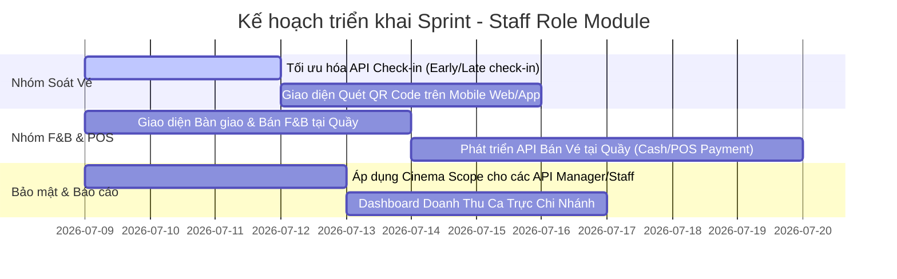

# Phân Tích Phạm Vi (Scope) Và Quy Định Nghiệp Vụ (Business Rules) Cho Vai Trò Nhân Viên (Staff)

Tài liệu này tổng hợp chi tiết phạm vi chức năng (Scope), quy định nghiệp vụ (Business Rules), và khoảng trống hệ thống (Gaps) liên quan trực tiếp đến vai trò **Nhân viên (Staff)**. Thông tin được đối chiếu từ tài liệu SRS, tài liệu Business Rules và mã nguồn hiện tại của dự án để hỗ trợ Quản lý dự án (PM) phân chia task.

---

## 1. Tổng Quan Vai Trò Staff (Staff Role Overview)
Trong hệ thống Cinema Booking, **Staff (Nhân viên rạp)** là người chịu trách nhiệm vận hành trực tiếp tại các cụm rạp vật lý. Công việc chính bao gồm:
*   Soát vé khách hàng vào phòng chiếu (qua QR Code hoặc nhập mã tay).
*   Bán sản phẩm Food & Beverage (F&B) trực tiếp tại quầy hoặc bàn giao F&B mà khách đặt online.
*   Hỗ trợ xử lý các sự cố nghiệp vụ phát sinh tại rạp (như đổi ghế, đổi món F&B nếu hết hàng).

---

## 2. Chi Tiết Phạm Vi Chức Năng (Scope of Features)

Dưới đây là bảng phân tách các chức năng dành cho Staff, phân biệt rõ giữa **Đã triển khai** (có API/Service chạy được) và **Chưa triển khai** (Khoảng trống nghiệp vụ cần phát triển thêm):

### 2.1. Nhóm chức năng đã có (Implemented)
| Chức năng | API Endpoint / Method | Trạng thái kỹ thuật | Mô tả |
| :--- | :--- | :--- | :--- |
| **Đăng nhập & Xác thực** | `POST /api/auth/login` | Hoàn thành | Đăng nhập bằng tài khoản Staff do Admin tạo, nhận JWT chứa claim `roleId = ROLE_STAFF`. |
| **Quét & Check-in Vé** | `POST /api/tickets/scan` | Hoàn thành | Quét mã QR code của vé, kiểm tra tính hợp lệ và cập nhật trạng thái vé thành `Checked-in` / `Used`. |
| **Ghi nhận lịch sử check-in** | Nằm trong luồng `ScanAsync` | Hoàn thành | Tự động tạo bản ghi lưu vào bảng `CHECKIN_LOG` ghi nhận: người quét, thời gian, kết quả, mã vé, lý do thất bại (nếu có). |
| **Xem sơ đồ & Layout rạp** | `GET /api/seats/room/{roomId}` `GET /api/seats/showtimes/{showtimeId}/map` | Hoàn thành | Xem sơ đồ ghế trống/đã bán/đang khóa của suất chiếu để hỗ trợ khách tìm chỗ. |
| **Bán F&B trực tiếp tại quầy** | `POST /api/fb/counter-order` | Hoàn thành | Staff tạo đơn bán F&B trực tiếp cho khách tại quầy (tạo booking kênh `COUNTER`, trừ kho nguyên thủy trực tiếp). |
| **Bàn giao F&B đặt trước** | `POST /api/fb/fulfill/{bookingId}` | Hoàn thành | Quét mã đơn hàng để bàn giao sản phẩm F&B cho khách đặt online. |

### 2.2. Nhóm chức năng chưa có / Khoảng trống nghiệp vụ (Gaps & Backlog)
| Chức năng | Yêu cầu nghiệp vụ | Ghi chú kỹ thuật |
| :--- | :--- | :--- |
| **Bán vé trực tiếp tại quầy (POS)** | Khách hàng đến quầy mua vé xem phim và thanh toán bằng tiền mặt/chuyển khoản trực tiếp với Staff. | Hiện hệ thống chỉ hỗ trợ đặt vé Online thông qua cổng SePay. Chưa có luồng thanh toán tại quầy (`bookingChannel = COUNTER` cho vé xem phim). |
| **Quản lý F&B (CRUD)** | Staff/Manager kiểm kê hoặc chỉnh sửa thông tin món F&B (chỉ có policy `CanManageFoodAndBeverage` nhưng chưa có Controller/Service). | Cần bổ sung các API thêm/sửa/xóa sản phẩm F&B toàn hệ thống hoặc theo chi nhánh. |
| **Dashboard doanh thu chi nhánh** | Xem báo cáo nhanh doanh thu bán vé/F&B trong ca làm việc tại rạp được phân quyền. | Đã định nghĩa policy `CanViewBranchDashboard` nhưng chưa viết code Controller/Service. |
| **Hỗ trợ khách đổi vé/đổi ghế** | Trường hợp phòng chiếu trống, nhân viên có thể đổi chỗ ngồi cho khách sau khi đã check-in. | Chưa có API cập nhật ghế sau khi vé đã ở trạng thái `Checked-in`. |

---

## 3. Quy Định Nghiệp Vụ Chi Tiết (Business Rules)

PM cần chú ý các quy định nghiệp vụ cốt lõi sau để thiết kế test case và logic hệ thống:

### 3.1. Nghiệp vụ Soát Vé & Check-in
1.  **Tính duy nhất của vé:** Một vé chỉ được check-in **đúng 1 lần**. Nếu quét lại vé đã sử dụng, hệ thống phải hiển thị cảnh báo lỗi `TicketAlreadyCheckedIn` và chỉ rõ thời gian vé đã quét trước đó.
2.  **Giới hạn rạp (Cinema Scope):** Nhân viên rạp nào chỉ được phép check-in cho vé thuộc rạp đó.
    *   *Ví dụ:* Nhân viên thuộc rạp Quận 1 (`cinemaId = CIN_ND_Q1`) quét vé của rạp Biên Hòa (`cinemaId = CIN_BH_DN`) -> Hệ thống trả lỗi `TicketWrongCinema` (403 Forbidden).
3.  **Khớp phòng & suất chiếu:** Vé phải đúng phòng chiếu (`RoomId`) và đúng suất chiếu (`ShowtimeId`). Nếu quét nhầm phòng -> Báo lỗi `TicketWrongRoom`.
4.  **Cửa sổ thời gian check-in (Time Window):**
    *   **Check-in sớm:** Khách được check-in trong đúng ngày chiếu, kể cả trước giờ bắt đầu suất chiếu. Quét trước ngày chiếu -> Báo lỗi `CheckInTooEarly`.
    *   **Check-in muộn:** Khách chỉ được check-in muộn nhất 30 phút sau khi suất chiếu bắt đầu. Quét quá trễ -> Báo lỗi `CheckInWindowClosed`.
5.  **Vé hợp lệ:** Không cho phép check-in đối với các vé thuộc đơn hàng (`Booking`) đã bị hủy (`CANCELLED`) hoặc đã hoàn tiền (`REFUNDED` / `REFUND_PENDING`).
6.  **Xác minh độ tuổi:** Đối với các phim dán nhãn giới hạn độ tuổi (T13, T16, T18, C), khi check-in, hệ thống phải cảnh báo Staff yêu cầu kiểm tra giấy tờ tùy thân (CCCD/thẻ học sinh) của khách hàng trước khi bấm xác nhận vào phòng.

### 3.2. Nghiệp vụ Food & Beverage (F&B) tại quầy
1.  **Quy tắc an toàn thực phẩm (Food Safety Restock Rule):** 
    *   Nếu đơn hàng F&B ở trạng thái **Chờ nhận (Pending)** và bị hủy -> F&B sẽ được tự động hoàn trả vào kho của rạp (`quantity = quantity + sold_quantity`).
    *   Nếu đơn hàng F&B đã được Staff **bàn giao thành công (Fulfilled)** cho khách -> Tuyệt đối **không được hoàn kho** kể cả khi khách yêu cầu hủy/hoàn tiền đơn hàng đó vì lý do an toàn thực phẩm.
2.  **Ràng buộc kho (Stock Control):** Khi Staff thực hiện bán F&B tại quầy (`COUNTER` order), hệ thống phải thực hiện trừ kho nguyên tử (Atomic Update) trên bảng `CINEMA_FB_INVENTORY` để tránh hiện tượng bán quá số lượng thực tế tại rạp.

---

## 4. Gợi Ý Phân Chia Task Cho PM (Task Breakdown)

Dựa trên các phân tích trên, PM có thể chia các task phát triển chức năng liên quan đến Staff thành các User Story sau:

### [Task 1] Tối ưu hóa và Bảo mật API Check-in vé (`CanScanTicket`)
*   **Mô tả:** Đảm bảo hệ thống kiểm tra chặt chẽ token của Staff, chỉ cho phép soát vé của đúng chi nhánh rạp được phân quyền (`StaffProfile.cinemaId`).
*   **Sub-tasks:**
    1.  Tích hợp bộ lọc `cinemaId` từ JWT Token của Staff vào logic kiểm tra vé.
    2.  Áp dụng quy tắc thời gian soát vé cố định: mở trong ngày chiếu và đóng sau 30 phút kể từ giờ bắt đầu suất chiếu.
    3.  Tạo test case kiểm tra check-in vé đã dùng, vé bị hủy, vé sai rạp.

### [Task 2] Phát triển chức năng Bán vé trực tiếp tại quầy (POS Ticket Sale)
*   **Mô tả:** Xây dựng luồng tạo booking mới với `bookingChannel = COUNTER` do Staff thực hiện, cho phép thanh toán tiền mặt/quẹt thẻ (không qua cổng webhook online).
*   **Sub-tasks:**
    1.  Tạo API `POST /api/bookings/counter` dành riêng cho Staff/Manager.
    2.  Bỏ qua bước tạo cổng giao dịch trực tuyến SePay, trực tiếp chuyển trạng thái Booking thành `PAID` và sinh mã QR Ticket ngay lập tức sau khi Staff xác nhận đã nhận tiền mặt từ khách.

### [Task 3] Xây dựng module Bàn giao & Bán F&B tại quầy
*   **Mô tả:** Phát triển giao diện và API hỗ trợ Staff kiểm tra đơn F&B đặt trước của khách và cập nhật trạng thái giao hàng, quản lý kho F&B của rạp.
*   **Sub-tasks:**
    1.  Tạo màn hình tìm kiếm đơn hàng F&B bằng Booking ID hoặc Số điện thoại khách hàng.
    2.  Tích hợp API `FulfillOrderAsync` để Staff nhấn nút "Đã giao F&B" cho khách.
    3.  Tạo trang xem tồn kho F&B hiện tại của rạp (`CINEMA_FB_INVENTORY`) dành cho Staff/Manager.

### [Task 4] Phát triển Dashboard doanh thu ca trực của Nhân viên
*   **Mô tả:** Hiển thị báo cáo doanh số bán vé và bán F&B mà nhân viên đó đã thực hiện trong ca làm việc để bàn giao tiền cuối ca.
*   **Sub-tasks:**
    1.  Tạo API `GET /api/dashboard/staff/shift-report` trả về: tổng số vé đã check-in, tổng số đơn F&B đã giao, tổng số tiền mặt/chuyển khoản đã thu tại quầy.
    2.  Giới hạn API chỉ cho phép nhân viên tự xem doanh số của chính mình hoặc Manager xem doanh số của toàn bộ nhân viên trong rạp.
