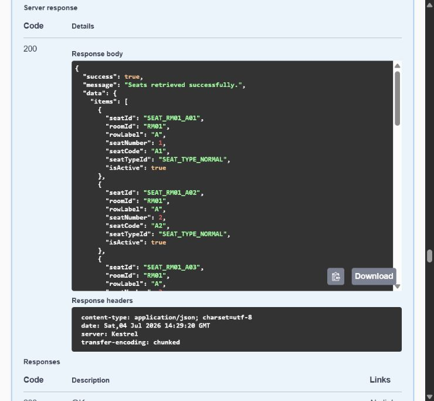
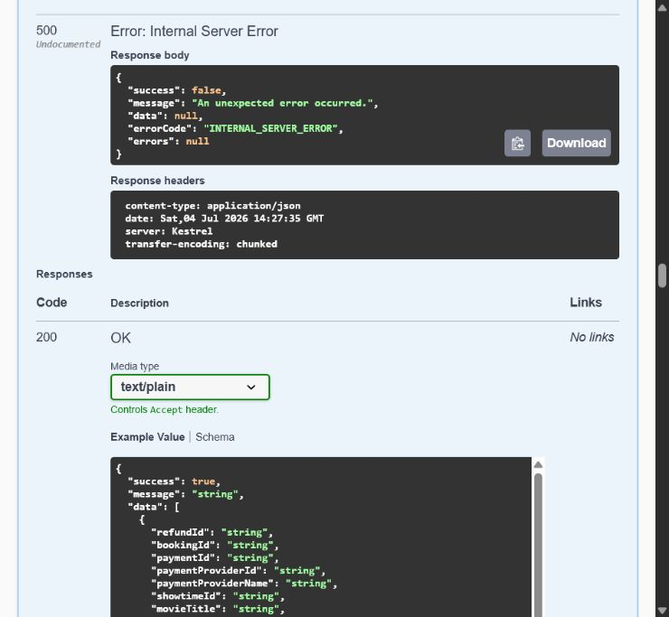
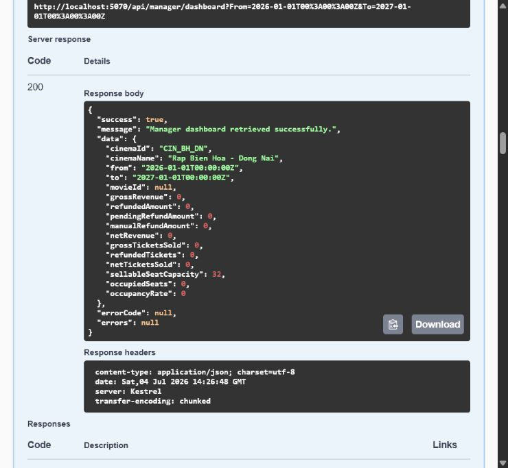
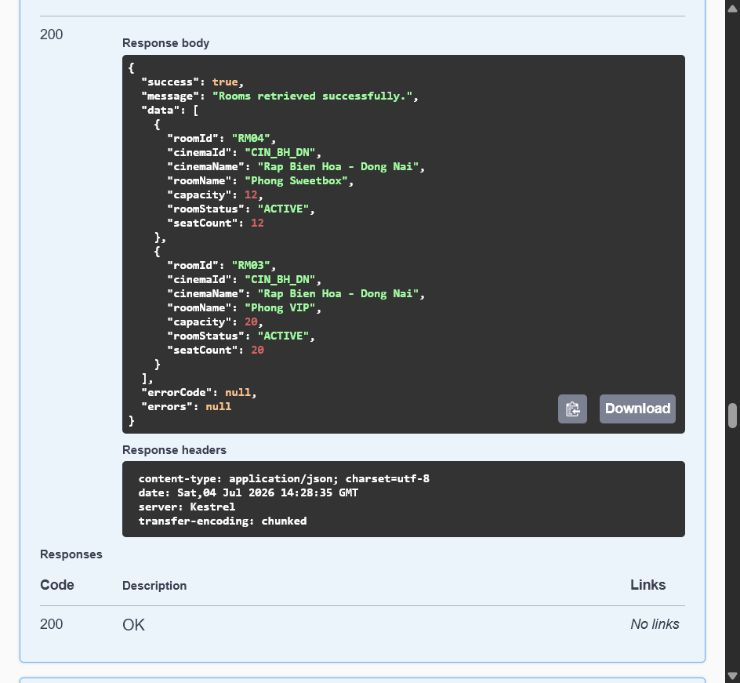
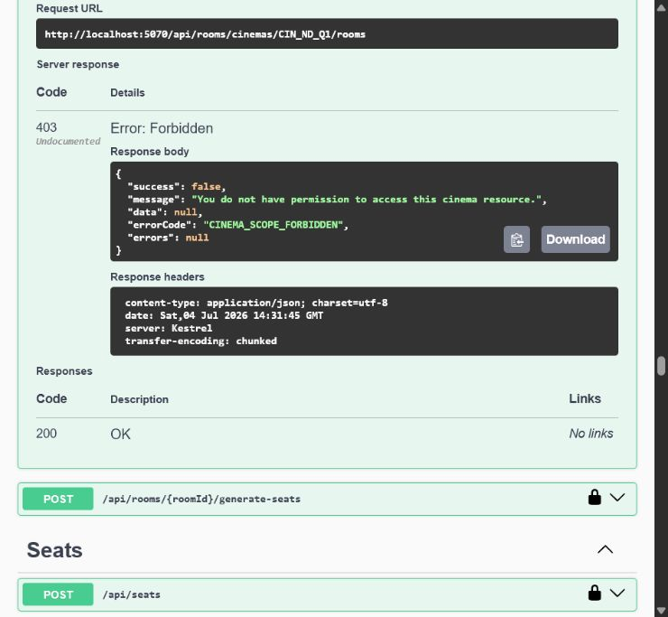
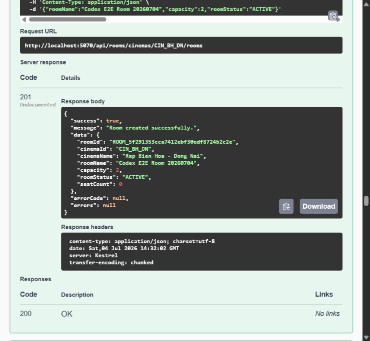
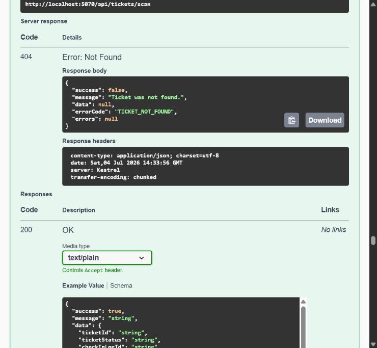

# Báo cáo kiểm thử chức năng Manager qua Swagger

## 1. Phạm vi và môi trường

- Thời điểm kiểm thử: `2026-07-04`, múi giờ `Asia/Bangkok`.
- Branch: `Tom/remove-hardcodes`.
- Commit: `3bebdf3`.
- Backend: `http://localhost:5070`.
- Swagger: `http://localhost:5070/swagger/index.html`.
- Database: database Development đang được cấu hình bởi
  `CinemaSystem/appsettings.Development.json`.
- Build trước khi test: thành công, `0` warning, `0` error.

Database Development không có tài khoản Manager đăng nhập được và repository
không lưu mật khẩu Manager. Để không đọc/ghi password hash hoặc refresh token,
phiên test tạo tạm danh tính sau:

- User ID: `USR_CODEX_MGR_E2E`
- Email: `manager.codex.e2e@test.local`
- Role: `MANAGER`
- Cinema scope: `CIN_BH_DN`
- Cinema: `Rap Bien Hoa - Dong Nai`

Swagger được authorize bằng JWT test cục bộ có thời hạn ngắn. JWT, password,
connection string và secret không được ghi vào báo cáo hoặc ảnh.

Giới hạn: luồng `POST /api/auth/login` không được kiểm thử vì không có credential
Manager hợp lệ. Phạm vi đã kiểm tra là authorization, cinema scope và các API
Manager bằng đúng danh tính Manager trong database.

## 2. Kết quả tổng hợp

| Nhóm | API / phép thử | Kỳ vọng | Thực tế | Kết quả |
|---|---|---|---|---|
| Dashboard | `GET /api/manager/dashboard` | Chỉ tổng hợp rạp `CIN_BH_DN` | `200`, trả đúng `cinemaId=CIN_BH_DN`, capacity `32` | PASS |
| Room scope | `GET /api/rooms/rooms` | Chỉ trả phòng của rạp Manager | `200`, chỉ có `RM03`, `RM04`, cùng thuộc `CIN_BH_DN` | PASS |
| Room create | `POST /api/rooms/cinemas/CIN_BH_DN/rooms` | Manager tạo được phòng trong rạp mình | `201`, tạo phòng test thành công | PASS |
| Room delete | `DELETE /api/rooms/rooms/{roomId}` | Manager quản lý được phòng vừa tạo | `200`, phòng chuyển `INACTIVE` | PASS |
| Cross-cinema | `POST /api/rooms/cinemas/CIN_ND_Q1/rooms` | Từ chối rạp ngoài scope | `403 CINEMA_SCOPE_FORBIDDEN` | PASS |
| Ticket scan | `POST /api/tickets/scan` với QR không tồn tại, phòng `RM03` | Request đi qua role/scope và trả lỗi nghiệp vụ | `404 TICKET_NOT_FOUND`, không phải `401/403` | PASS |
| Cancel showtime | `POST /api/manager/showtimes/SHW_CODEX_NOT_FOUND/cancel` | Request đi qua role và trả không tìm thấy | `404 SHOWTIME_NOT_FOUND` | PASS |
| Refund list | `GET /api/manager/refunds` | Trả danh sách refund trong rạp Manager | `500 INTERNAL_SERVER_ERROR` | FAIL |
| Seat list scope | `GET /api/seats` | Chỉ trả ghế thuộc rạp Manager | `200` nhưng trả ghế `RM01` của `CIN_ND_Q1` | FAIL |

Kết luận runtime: `7 PASS`, `2 FAIL`.

## 3. Lỗi phát hiện

### MGR-SWAGGER-001 - Rò dữ liệu ghế khác rạp - Đã sửa 2026-07-05

- Mức độ: Critical.
- Trạng thái: Fixed in code, automated regression tests passed.
- API: `GET /api/seats`.
- Manager được gắn `CIN_BH_DN`.
- Response trả `SEAT_RM01_A01`, `SEAT_RM01_A02`, ... thuộc phòng `RM01`.
- Đối chiếu DB: `RM01` thuộc `CIN_ND_Q1`, không thuộc rạp của Manager.

Nguyên nhân code:

- `SeatsController.GetSeats` gọi thẳng `ISeatService.GetSeatsAsync` mà không lấy
  scope từ `ICinemaScopeAuthorizationService`.
- `SeatService.GetSeatsAsync` chỉ lọc `roomId` và `isActive`, không lọc
  `Seat.Room.CinemaId`.
- `SeatsController.GetSeatById` cũng chưa authorize cinema scope trước khi đọc
  một ghế cụ thể; đây là rủi ro cùng nhóm cần bổ sung test runtime.

Phương án sửa:

1. Controller lấy `CinemaScopeAuthorizationResult` như `RoomsController`.
2. Thêm `cinemaScopeId` vào `ISeatService.GetSeatsAsync`.
3. Lọc `seat.Room.CinemaId == cinemaScopeId` trong query.
4. Với `GET /api/seats/{seatId}`, gọi `AuthorizeSeatAsync` trước khi đọc.
5. Bổ sung integration test Manager không đọc được danh sách/chi tiết ghế của
   rạp khác.

Đã triển khai:

- `SeatsController.GetSeats` lấy scope bằng
  `ICinemaScopeAuthorizationService.GetUserCinemaScopeAsync`.
- `ISeatService.GetSeatsAsync` nhận `cinemaScopeId`.
- `SeatService.GetSeatsAsync` lọc `seat.Room.CinemaId == cinemaScopeId`.
- `SeatsController.GetSeatById` gọi `AuthorizeSeatAsync` trước khi đọc.
- Admin tiếp tục bypass bằng `cinemaScopeId = null`.

Kết quả regression:

- `ManagerCinemaScopeApiIntegrationTests`: `9/9` passed.
- Full solution: `247/247` passed.
- Build: `0` warnings, `0` errors.

Ảnh dưới đây là bằng chứng lỗi trước khi sửa, được giữ lại để truy vết.



### MGR-SWAGGER-002 - Manager Refund trả 500 do lệch schema - Patch ready

- Mức độ: Blocker.
- Trạng thái: SQL/schema đã được sửa trong repository; DB Development chưa áp
  dụng được vì môi trường từ chối quyền thực thi `sqlcmd` trước khi lệnh chạy.
- API: `GET /api/manager/refunds`.
- Response: `500 INTERNAL_SERVER_ERROR`.
- Exception server: `Invalid object name 'REFUND_CLAIM'`.

Nguyên nhân:

- `RefundService.GetRefundsAsync` projection truy cập navigation
  `item.RefundClaim`.
- EF Core mapping đã khai báo bảng `REFUND_CLAIM`.
- Database Development và `docs/database/cinema-booking-schema.sql` hiện chưa có
  phần tạo bảng `REFUND_CLAIM`; repository cũng chưa có SQL patch refund claim.

Phương án sửa:

1. Tạo SQL patch idempotent cho toàn bộ refund workflow, không chỉ một bảng:
   `REFUND_CLAIM`, `REFUND_CLAIM_TOKEN`, các bảng manual/customer refund liên
   quan, index, constraint và foreign key.
2. Cập nhật `docs/database/cinema-booking-schema.sql` thành schema tổng mới.
3. Chạy patch trên DB Development.
4. Chạy lại Swagger và integration test trên SQL Server thật; InMemory test hiện
   không phát hiện schema drift này.

Đã triển khai trong repository:

- tạo patch idempotent
  `docs/database/SCRUM-193-customer-assisted-refund-patch.sql`;
- cập nhật `docs/database/cinema-booking-schema.sql`;
- bổ sung `BANK_DIRECTORY`, `REFUND_CLAIM`, `REFUND_CLAIM_TOKEN`,
  `CUSTOMER_REFUND_REQUEST`, `MANUAL_REFUND_PROCESS`;
- mở rộng `CK_REFUND_STATUS` với `MANUAL_REQUIRED`;
- bổ sung index, unique constraint, foreign key và seed 5 ngân hàng;
- loại bỏ `USE [CinemaBookingDB]` để không hardcode database name;
- tạo handoff
  `docs/database/SCRUM-193-customer-assisted-refund-db-changes.md`.

Kiểm tra code sau thay đổi:

- refund/cinema-scope targeted tests: `18/18` passed;
- full solution: `247/247` passed;
- build: `0` warnings, `0` errors.

Chưa thể đánh dấu runtime fixed cho đến khi patch được áp dụng và Swagger
`GET /api/manager/refunds` trả `200` trên SQL Server Development.



## 4. Bằng chứng Swagger

### Dashboard đúng cinema scope



### Danh sách phòng đúng cinema scope



### Chặn thao tác khác rạp



### Tạo phòng trong đúng rạp



### Manager được phép vào luồng scan vé

QR test không tồn tại nên kết quả nghiệp vụ đúng là `404 TICKET_NOT_FOUND`.



## 5. Automated tests

Targeted Manager tests:

```powershell
dotnet test CinemaSystem.Tests\CinemaSystem.Tests.csproj `
  --no-build --no-restore `
  --filter "FullyQualifiedName~ManagerCinemaScopeApiIntegrationTests|FullyQualifiedName~ManagerDashboardApiIntegrationTests|FullyQualifiedName~ShowtimeCancellationApiIntegrationTests|FullyQualifiedName~TicketScanApiIntegrationTests"
```

Kết quả: `34 passed`, `0 failed`, `0 skipped`.

Full solution:

```powershell
dotnet test CinemaSystem.sln --no-build --no-restore
```

Kết quả: `244 passed`, `0 failed`, `0 skipped`.

Hai lỗi runtime vẫn tồn tại dù automated tests xanh:

- test hiện chưa cover `GET /api/seats` theo cinema scope;
- EF Core InMemory không phát hiện bảng SQL Server bị thiếu.

## 6. Dữ liệu test và cleanup

Phiên test đã tạo:

- Manager fixture `USR_CODEX_MGR_E2E`;
- Staff profile `STF_CODEX_MGR_E2E`;
- phòng `ROOM_5f291353cca7412ebf30edf8724b2c2e`;
- một failed `CHECKIN_LOG` từ QR không tồn tại.

Swagger đã soft-delete phòng sang `INACTIVE`. Cleanup DB được thực hiện sau khi
người dùng cấp quyền bằng lệnh có điều kiện sau:

```sql
SET XACT_ABORT ON;
BEGIN TRAN;

DELETE FROM dbo.[CHECKIN_LOG]
WHERE [scannedByUserId] = 'USR_CODEX_MGR_E2E'
   OR [staffProfileId] = 'STF_CODEX_MGR_E2E';

IF OBJECT_ID(N'dbo.AUDIT_LOG', N'U') IS NOT NULL
    DELETE FROM dbo.[AUDIT_LOG]
    WHERE [userId] = 'USR_CODEX_MGR_E2E';

DELETE FROM dbo.[ROOM]
WHERE [roomId] = 'ROOM_5f291353cca7412ebf30edf8724b2c2e'
  AND [roomName] = N'Codex E2E Room 20260704';

DELETE FROM dbo.[STAFF_PROFILE]
WHERE [staffProfileId] = 'STF_CODEX_MGR_E2E'
  AND [userId] = 'USR_CODEX_MGR_E2E';

DELETE FROM dbo.[USER]
WHERE [userId] = 'USR_CODEX_MGR_E2E'
  AND [email] = 'manager.codex.e2e@test.local';

COMMIT;
```

Lệnh cleanup dùng điều kiện theo ID và email/tên fixture cố định, không xóa dữ
liệu Manager hoặc phòng khác.

Kết quả xác nhận sau cleanup:

- `FIXTURE_USERS = 0`
- `FIXTURE_ROOMS = 0`
- `FIXTURE_LOGS = 0`

Database đã sạch toàn bộ dữ liệu do phiên Manager Swagger E2E này tạo.
